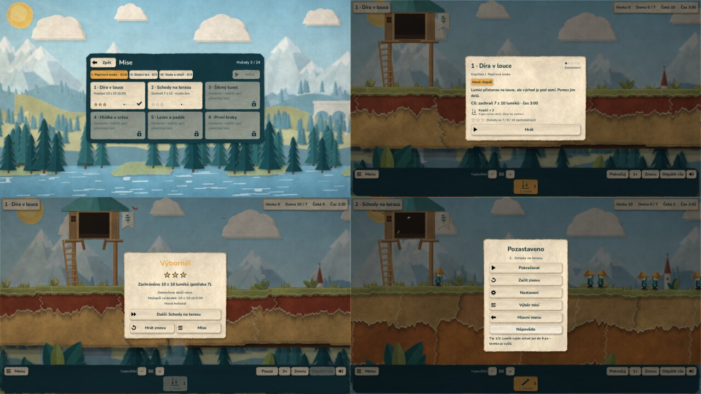
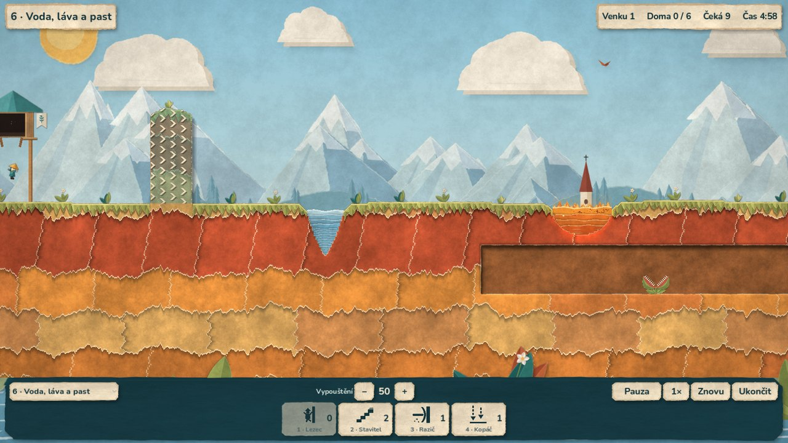

# Paperlings

Papírová logická hra v enginu Godot: provedeš zástup origami postaviček
nástrahami k východu – dovednostmi kopáče, stavitele, horníka a dalších.
Inspirovaná klasickou hrou Lemmings (1991), s vlastní grafikou, zvuky
a misemi; s původní hrou ani jejími vlastníky není nijak spojená.
Pracovní název projektu (a repozitáře) byl **Lemmings 2026**.

Architektura: [`docs/ARCHITEKTURA.md`](docs/ARCHITEKTURA.md) ·
Stav projektu: [`PROJECT_STATUS.md`](PROJECT_STATUS.md) ·
Plán vývoje: [`docs/PLAN_VYVOJE.md`](docs/PLAN_VYVOJE.md) ·
Herní design: [`docs/HERNI_DESIGN.md`](docs/HERNI_DESIGN.md)

## Novinka: kampaň s kapitolami a hvězdami

Hra startuje **hlavním menu** nad papírovou krajinou. **Mise** jsou
rozdělené do kapitol (I. Papírová louka, II. Skalní les, III. Voda a oheň,
IV. Bouřková hora)
a odemykají se postupně; **Hřiště** se všemi dovednostmi se otevře
po kapitole I. Každá mise začne **úvodní kartou** (cíl, dovednosti
s popisem, co je nového, obtížnost) a za výsledek dostaneš **1–3 hvězdy**.
V pauze (tlačítko **Menu**, **Esc**, na Androidu **Zpět**) je **nápověda**
s **Ukázkou řešení**, nastavení a návrat do menu. Pozastavenou hru posune
tlačítko **Krok** o jeden tik, rychlost jde přepnout i na **½×** a **−5 s**
vrátí hru o pět sekund. Každá kapitola má vlastní krajinu a počasí
(louka, skalní les, sopka, bouřková hora).
Postup, hvězdy a rozehraná mise se ukládají.
Hotové jsou všechny čtyři kapitoly – 24 misí od Seznámení po
Origami finále; obtížnost každé mise je změřená z ověřeného řešení.



Návrh celé kampaně (20 misí) a systém obtížnosti:
[`docs/HERNI_DESIGN.md`](docs/HERNI_DESIGN.md) · stav a ověření:
[`docs/ETAPA_9_OVERENI.md`](docs/ETAPA_9_OVERENI.md) · menu a ukládání:
[`docs/ETAPA_6_OVERENI.md`](docs/ETAPA_6_OVERENI.md).

## Výchozí zobrazení — 2D origami

Hra se nově spouští v **papírovém 2D origami stylu** podle přijatého
[mockupu](docs/MOCKUP_ORIGAMI.md): tyrkysové skládané postavičky
s okrovými čepicemi, terén z vrstev trhaného papíru, pruh zeleného drnu s trávou, papírová
líheň a východ, harmonikové schody a krajina ve čtyřech paralaxních
vrstvách s posunem i zoomem. Terén tvoří vystřižené kusy papíru s bílými
natrženými okraji a měkkými stíny, postavy se hýbou jako papírové loutky
(stop-motion, klávesa **M** přepne na plynulý pohyb). Simulace a všechny
mise jsou beze změny.


Krátký záznam chůze, ražení, stavění, kopání, posunu a zoomu:
[`docs/images/origami-zaznam.mp4`](docs/images/origami-zaznam.mp4).
Ověření a meze: [`docs/ORIGAMI_OVERENI.md`](docs/ORIGAMI_OVERENI.md).

Základní scéna `main/game.tscn` (jednoduché 2D) slouží k ladění; dřívější
2.5D zobrazení bylo 4. 10. 2026 vyřazeno.

**Nově voda, láva, pasti a jednosměrné zdi** (etapa 5) a mise
„6 · Voda, láva a past“: voda topí, láva pálí, masožravá rostlina sežere
jednoho a chvíli se dobíjí, zeď se šipkami prorazíš jen ve směru šipek.
Most z cihel přes vodu i lávu vydrží.



Záznam: [`docs/images/etapa5-mise6.mp4`](docs/images/etapa5-mise6.mp4) ·
pravidla a ověření: [`docs/ETAPA_5_OVERENI.md`](docs/ETAPA_5_OVERENI.md).

**Zvuky:** papírové efekty dovedností, nebezpečí, líhně, východu
a rozhraní, okolní vítr a smyčky vody a lávy, krátké znělky výhry
a prohry. V sestavení 1.0.0-rc2 jsou **čtyři dodané skladby**:
po misích se střídají 1 → 2 → 3 → 4 a znovu od začátku,
uvnitř mise se vybraná skladba opakuje. Hlasitost mění
**Nastavení → Zvuk → Hudba**. [Podrobnosti a ověření hudby](docs/HUDBA.md).
Dosavadní zveřejněná sestavení 1.0.0-rc1 hudbu ještě neobsahují. Ukázka efektů:
[`docs/audio/zvukova-ukazka.m4a`](docs/audio/zvukova-ukazka.m4a) · mise 6
se zvukem: [`docs/images/zvuk-mise6.mp4`](docs/images/zvuk-mise6.mp4) ·
popis: [`docs/ZVUK.md`](docs/ZVUK.md).

## Platformy

Hra vychází pro **Windows**, **macOS (Apple Silicon i Intel)** a **Android**
ze stejného herního jádra; Linux slouží jen k automatickým kontrolám.
Výchozí scéna je `main/game_origami.tscn`.

## Stažení

[**Stáhnout Android APK 1.0.0-rc3**](https://raw.githubusercontent.com/JendaNDT/Lemmings-2026/refs/heads/downloads/android-1.0.0-rc3/android/Paperlings-1.0.0-rc3-Android.apk) ·
[**Stáhnout Windows ZIP**](https://raw.githubusercontent.com/JendaNDT/Lemmings-2026/refs/heads/downloads/android-1.0.0-rc2/windows/Paperlings-1.0.0-rc2-Windows.zip)

Stažení z GitHubu je ověřené proti SHA-256. Stránka na jenda.cool je připravená,
ale zatím není zveřejněná: zápis do repozitáře webu končí odmítnutím přístupu.

Oba balíčky obsahují čtyři hudební skladby a 24 misí:

| Soubor | Pro |
|---|---|
| `Paperlings-1.0.0-rc2-Windows.zip` | Windows 10/11, 64 bit – rozbal a spusť `Paperlings.exe` |
| `Paperlings-1.0.0-rc3-Android.apk` | Android 7.0+, telefon i tablet – aktualizace rc2 |

**Android rc3 instaluj přes rc2 bez odinstalace – postup zůstane.** Má stejný
podpis a identitu `cool.jenda.paperlings`. Opravuje zbytečné vykreslování do
plného rozlišení displeje a slučuje kreslení trávy; na jemných displejích je
obraz trochu měkčí. [Měření a ověření výkonu](docs/VYKON_ANDROID.md).
Starou testovací hru `org.lemmings2026.demo` neaktualizuje ani nemaže;
první instalace nové identity začíná od první mise.
Windows není digitálně podepsaný. Export, hudba a kontrolní součty jsou
ověřené v cloudu; skutečné FPS rc3 na uživatelově Androidu čeká na ověření.

[Návod pro hráče](docs/NAVOD.md) · [Android rc3](docs/vydani/1.0.0-rc3.md) ·
[Windows rc2](docs/vydani/1.0.0-rc2.md).
Předchozí [vydání rc1 pro Windows, macOS a Android](https://github.com/JendaNDT/Lemmings-2026/releases/tag/v1.0.0-rc1)
zůstává dostupné, ale hudbu ještě nemá.

Jak vzniká vydání: `python scripts/release.py build` (kontrola, exporty
a balíčky), Android přes `scripts/export_android.sh` se správným soukromým
klíčem. Podrobnosti: [`docs/ANDROID_DEMO.md`](docs/ANDROID_DEMO.md).

## Starší verze

APK 0.4.0 a dřívější Mac balíček obsahují vyřazenou 2.5D grafiku
([historický záznam](docs/GRAFIKA_04.md)); nový Mac balíček s origami
zatím nevznikl.

## Spuštění hotové verze na Macu

Rozbal `Lemmings-2026-macOS.zip` a otevři `Lemmings 2026.app`.
Godot nemusí být nainstalovaný. Ovládání je níže.

Jde o vývojové sestavení s ad-hoc podpisem, bez notarizace Apple. Pokud
macOS první spuštění zablokuje, potvrď otevření této konkrétní aplikace
v **Nastavení systému → Soukromí a zabezpečení → Přesto otevřít**.
Není potřeba vypínat zabezpečení systému.

Průchod celým levelem a grafika byly ověřeny v linuxovém cloudu na
samostatném exportu. Spuštění přímo na Macu zatím čeká na uživatelské
ověření. Aktuální výsledky: [`docs/ETAPA_3_OVERENI.md`](docs/ETAPA_3_OVERENI.md).

## Jak to spustit

1. Stáhni **Godot 4.7** (standardní verze, ne .NET; funguje i opravná 4.7.1) z
   [godotengine.org/download](https://godotengine.org/download).
2. Spusť Godot → **Import** → vyber soubor `project.godot` z tohohle repozitáře.
   První import papírových textur chvíli trvá.
3. Stiskni **F5** (nebo ▶ vpravo nahoře). Spustí se hlavní menu
   (`main/app.tscn`). Samotnou origami misi bez menu spustíš otevřením
   `main/game_origami.tscn` a **F6**. Při spuštění bez menu se postup
   neukládá.

## Vytvoření vlastního sestavení

Použij standardní Godot **4.7 stable** a exportní šablony stejné verze
(v editoru **Editor → Manage Export Templates**). Potom z kořene projektu:

```bash
bash scripts/export_desktop.sh macos
```

Výsledkem je `build/macos/Lemmings-2026-macOS.zip`. Skript lze spustit
na macOS i Linuxu; pokud Godot není v PATH, nastav `GODOT_BIN` na jeho
spustitelný soubor. Výstupní složka `build/` je ignorovaná Gitem.

Další volby jsou `windows` (budoucí distribuce) a `linux-qa` (kontroly
samostatné hry v cloudu). Všechny exportují stejné scény a GDScripty;
testy, dokumentace a vývojové skripty se do hry nebalí. Testování přímo
na Windows je plánované na závěr vývoje.

## Automatické ověření

Potřebuješ Python 3.10+ a standardní Godot 4.7. Nástroje nainstaluj
do virtuálního prostředí a spusť společnou kontrolu:

```bash
python3 -m venv build/venv
source build/venv/bin/activate
python -m pip install -r scripts/requirements-dev.txt
python scripts/check.py
```

Pokud Godot není v PATH, použij `--godot /cesta/k/Godotu` nebo proměnnou
`GODOT_BIN`. Volitelně jej stáhne `python scripts/install_godot.py`:
ověří oficiální SHA-512 a vypíše cestu k binárce pro Linux x86_64 nebo macOS.
Exportní šablony tento pomocný instalátor neinstaluje.

Kontrola zahrnuje integritu podkladů (včetně origami sady), parser a linter
všech GDScriptů, čistý import, mechaniky, řešení levelu, replay, herní smyčku
s HUD, geometrii 3D terénu, výběr myší a časování animací. Sada
`test_origami` ověřuje převod souřadnic, zoom kolem kurzoru, hranice mapy,
paralaxu bez mezer a skoků, dotyky, animace podle tiků a celou první misi
přes origami scénu (20/20, shoda s čistou simulací). Běží v dočasné kopii,
původní soubory nemění; logy ukládá do `build/checks/`. Selže také při chybě
Godotu s návratovým kódem 0, chybějícím výsledku nebo timeoutu. Stejný
postup používá připravené CI pro Linux a macOS. Verze Godotu musí být řada
4.7 stable; opravná vydání (4.7.1 …) jsou povolená, jiné verze ne.

Grafický průchod origami s ukládáním snímků (potřebuje grafický výstup,
v cloudu Xvfb):

```bash
godot --path . --rendering-driver opengl3 --script res://scripts/qa_origami.gd \
  -- --capture-dir=build/origami/desktop [--mobile] [--record=build/origami/frames] [--gallery]
```

Podklady origami se znovu vygenerují příkazem
`python assets/origami/source/build_all.py` (potřebuje NumPy, Pillow, SciPy);
`--check` jen ověří, že generátor dává stejné soubory.

Volba `--benchmark` navíc změří čistou simulaci 200 lumíků po dobu 1700 tiků
a 3D prezentaci s 200 postavami a souběžnou prací po dobu 240 tiků.
Jde o CPU práci bez GPU kreslení, nikoli o FPS hry. Podrobnosti a grafický
kontrolní průchod jsou v [`docs/ETAPA_3_OVERENI.md`](docs/ETAPA_3_OVERENI.md).

## Ovládání

| Akce | Ovládání |
|---|---|
| Vybrat dovednost | klik na liště dole nebo klávesy **1–8** |
| Přidělit dovednost | levý klik na lumíka |
| Posun kamery | šipky / **WASD** / myš u okraje / tažení pravým tlačítkem / jeden prst |
| Přiblížení | kolečko myši nebo gesto na touchpadu (kolem kurzoru) / dva prsty |
| Pauza | **mezerník** nebo **P** |
| Zrychlení 3× | **F** |
| Vypouštění pomaleji / rychleji | **−** / **=** (nebo na numerické klávesnici) |
| Restart levelu | **R** |
| Menu (pauza, nápověda, nastavení, výběr misí) | **Esc**, tlačítko **Menu** vlevo dole, na Androidu **Zpět** |
| Odpálit vše (hromadné ukončení) | **N** nebo **Odpálit vše**, poté potvrzení; **Esc** zruší dialog |
| Stop-motion ↔ plynulý pohyb postav (jen vzhled) | **M** |
| Zvuk zapnout / ztlumit | **T** nebo tlačítko s reproduktorem v dolní liště |

Postup a nastavení se ukládají do uživatelské složky Godotu
(na Macu `~/Library/Application Support/Godot/app_userdata/Lemmings 2026/`,
na Androidu do soukromých dat aplikace): `progress.json` a `settings.json`
se zálohami `.bak`. Smazat postup jde v **Nastavení → Hra**.

## Jak upravit level

Otevři `levels/level_01.tscn`. Pravidla levelu (počet lumíků, dovednosti,
čas) jsou v Inspectoru u kořenového uzlu. Terén tvoří uzly `TerrainShape`
– vyber jeden a body mnohoúhelníku můžeš tahat myší. Druh tvaru (`Kind`)
může být hlína, ocel, výřez, voda, láva nebo jednosměrná zeď; past je uzel
`LemmingTrap` postavený na zem. Chyby v levelu hlásí žlutý trojúhelník
u kořenového uzlu (ukázka: `levels/level_hazards.tscn`). Nová mise
potřebuje vlastní **Level Id** (malá písmena a pomlčky) a zařazení
do `Campaign.SCENES` v `main/campaign.gd`.

## Právní poznámka

Paperlings © 2026 Jenda – volně ke hraní, ostatní práva vyhrazena
([`LICENSE.txt`](LICENSE.txt)). Inspirováno hrou Lemmings (1991, DMA
Design); s původní hrou ani s vlastníkem značky Lemmings není projekt
nijak spojený a nepoužívá z ní obrázky, zvuky, písma ani mise. Godot
Engine má licenci MIT, písmo Nunito SIL Open Font License 1.1
([`assets/fonts/OFL.txt`](assets/fonts/OFL.txt)); seznam součástí třetích
stran je ve hře (O hře → Licence) a v `THIRD_PARTY_NOTICES.txt` u vydání.
