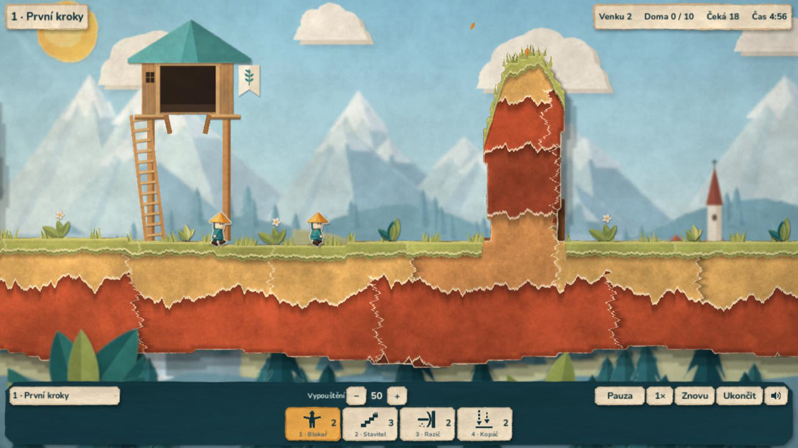

# Android demo 0.5.0

Vývojové APK s novou **2D origami grafikou**, šesti misemi (nová mise
„6 · Voda, láva a past“) a **zvuky**. Hudba přijde později. Společné jádro
je stejné pro všechny platformy. Popis změn: [origami](ORIGAMI_OVERENI.md),
[etapa 5](ETAPA_5_OVERENI.md), [zvuky](ZVUK.md).



## Stažení a instalace

[Stáhnout APK z GitHubu](https://github.com/JendaNDT/Lemmings-2026/raw/refs/heads/downloads/android-0.5.0/android/Lemmings-2026-Android-0.5.0.apk) (66 MiB).

Soubor `Lemmings-2026-Android-0.5.0.apk` je v samostatné větvi
`downloads/android-0.5.0`, spolu s návodem a SHA-256 kontrolním součtem.
Starší APK zůstávají ve větvích `downloads/android-0.4.0` a dřívějších.
Stáhnout na telefon nebo tablet, otevřít a případně povolit instalaci
z použitého prohlížeče či správce souborů. Hra se jmenuje
**Lemmings 2026 Demo** a běží na šířku.

**Před instalací odinstaluj verzi 0.4.0.** APK 0.5.0 je podepsané jiným
testovacím klíčem (původní klíč zůstal v zaniklém cloudovém prostředí),
takže ho Android jako aktualizaci nepřijme a hlásí „Aplikace nebyla
nainstalována“. Hra zatím neukládá postup, odinstalací se nic neztratí.

- Android 7.0 / API 24 a novější, OpenGL ES 3.0.
- Architektury `arm64-v8a` a `armeabi-v7a` v jednom APK.
- Verze 0.5.0, versionCode 6, balíček `org.lemmings2026.demo`.
- Target SDK 36; aplikace nepožaduje žádná Android oprávnění.
- Testovací podpis Android Debug, schémata v2/v3. Není určený pro vydání
  do Google Play; soukromý klíč je mimo repozitář i předávané artefakty.
  Certifikát SHA-256:
  `fdb924fa25c6dfec478caa66dd8ba03ec91909d475de240d9213a50f6681407f`.

SHA-256 APK: `e1cc9a69bfccff8b3572a7cca80728fe0be543e2bc2a87ec701bc0ca72013d55`.

## Ovládání a profil

Klepnutí na dovednost a potom na postavu přidělí příkaz. Posun jedním prstem
posouvá kameru, dva prsty ji posouvají i přibližují. Dovednost se přidělí
až při uvolnění prstu bez významného pohybu. Emulovaná myš nevytvoří druhý
příkaz. Dotyky začaté na HUDu se nepřenesou do herní plochy.

Mise se vybírají vlevo v dolní liště. Osm dovedností se vejde
na společný spodní řádek. Reproduktor vpravo v liště zvuk ztlumí (volba
se pamatuje). **Ukončit** vyžaduje potvrzení; v dialogu se čas zastaví
a klepnutí nepřidělí dovednost postavě pod oknem.

Dotykový výběr má širší dosah a vybírá nejbližší postavu, které lze aktuální
dovednost přidělit. Zpět přepíná pauzu; přechod na pozadí vždy hru pozastaví
a vymaže rozpracovaná gesta. Obnovení pohybu zůstává na hráči.

Android používá Compatibility / OpenGL ES 3, návrhový viewport 1280 × 720,
75% rozlišení 3D, menší stíny a vypnuté SSAO/MSAA. Světla jsou vyvážená
pro tento renderer. Herní logika se podle platformy nevětví.

## Ověření a omezení

- Před exportem prošla kompletní kontrola `python scripts/check.py`:
  74 GDScriptů, 11 sad, 327 kontrol (simulace, mise 1–6 včetně řešení,
  origami zobrazení, dotyk, zvuky).
- Ověřený podpis v2/v3 (`apksigner`), zarovnání (`zipalign -c 4`), manifest
  (verze, API 24/36, žádná oprávnění, orientace na šířku), obě ARM
  architektury a přiložené licence (písmo OFL, origami, zvuky). Testy,
  dokumentace ani zdroje generátorů se nebalí.
- Herní soubory vytažené přímo z APK (`assets.sparsepck`) se v Linuxu
  spustily v rendereru Compatibility (OpenGL, softwarový llvmpipe):
  výchozí origami scéna se vykreslila a v záznamu (Movie Maker) hrál zvuk
  (snímek výše). V logu byla jen hlášení cloudu bez zvukové karty a V-Sync.

Linuxové spuštění nepotvrzuje instalaci ani běh Android Activity.
V tomto cloudu nebylo dostupné připojené Android zařízení ani emulátor.
Nativní spuštění, výkon (origami shadery, paralaxa), zvuk v telefonu,
zahřívání a specifika telefonu/tabletu proto ještě nejsou ověřené.

## Opakování exportu

Použít Godot 4.7 stable a stejné Android exportní šablony (ověřené SHA-512).
V nastavení editoru vyplnit Android SDK a Java SDK. Pro APK bez Gradlu stačí
Java 21 a nástroje `apksigner` a `zipalign` z Build Tools; v cloudu 0.5.0
byly oficiální balíčky Googlu nedostupné, proto posloužily balíčky Ubuntu
`apksigner` a `zipalign` vložené do adresáře SDK (`build-tools/35.0.1`).

```bash
python scripts/check.py
bash scripts/export_android.sh
```

Výstup je `build/android/Lemmings-2026-Android.apk`. Debug klíč spravuje
Godot mimo projekt (`~/.local/share/godot/keystores/debug.keystore`).
Pro aktualizace stejné instalace je potřeba uchovat stejný klíč; bez něj
musí hráč starší verzi odinstalovat. Pro produkční distribuci připravit
samostatný spravovaný podpis.

Grafický test dotyků na Linuxu:

```bash
godot --path . --rendering-method gl_compatibility --audio-driver Dummy \
  --resolution 1280x720 --script res://scripts/qa_3d.gd \
  -- --touch --mobile-preview --capture-dir=/tmp/lemmings-touch
```

Varování llvmpipe o V-Sync a desktopovém 2D MSAA při přepnutí rendereru
jsou zaznamenaná; Android profil MSAA vypíná. Výsledky neuvádějí FPS telefonu.
