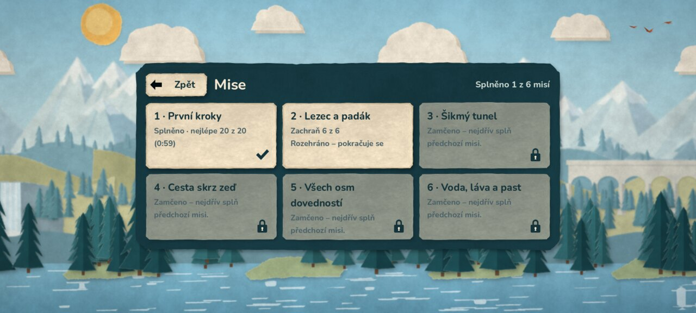

# Android demo 0.6.0

Vývojové APK s **hlavním menu, výběrem misí, nastavením a ukládáním
postupu** (etapa 6), 2D origami grafikou, šesti misemi a zvuky. Hudba
přijde později. Společné jádro je stejné pro všechny platformy. Popis
změn: [etapa 6](ETAPA_6_OVERENI.md), [origami](ORIGAMI_OVERENI.md),
[etapa 5](ETAPA_5_OVERENI.md), [zvuky](ZVUK.md).



## Stažení a instalace

[Stáhnout APK z GitHubu](https://github.com/JendaNDT/Lemmings-2026/raw/refs/heads/downloads/android-0.6.0/android/Lemmings-2026-Android-0.6.0.apk) (66 MiB).

Soubor `Lemmings-2026-Android-0.6.0.apk` je v samostatné větvi
`downloads/android-0.6.0`, spolu s návodem a SHA-256 kontrolním součtem.
Starší APK zůstávají ve větvích `downloads/android-0.5.0` a dřívějších.
Stáhnout na telefon nebo tablet, otevřít a případně povolit instalaci
z použitého prohlížeče či správce souborů. Hra se jmenuje
**Lemmings 2026 Demo** a běží na šířku.

**Aktualizace z 0.5.0** proběhne přímo (stejný testovací podpis).
Z verze 0.4.0 a starší je potřeba nejdřív odinstalovat (jiný podpis).

Mise se nově odemykají postupně. Pro rychlé vyzkoušení libovolné mise
zapni **Nastavení → Hra → Všechny mise odemčené**.

- Android 7.0 / API 24 a novější, OpenGL ES 3.0.
- Architektury `arm64-v8a` a `armeabi-v7a` v jednom APK.
- Verze 0.6.0, versionCode 7, balíček `org.lemmings2026.demo`.
- Target SDK 36; aplikace nepožaduje žádná Android oprávnění.
- Testovací podpis Android Debug, schémata v2/v3. Není určený pro vydání
  do Google Play; soukromý klíč je mimo repozitář i předávané artefakty.
  Certifikát SHA-256 (stejný jako 0.5.0):
  `fdb924fa25c6dfec478caa66dd8ba03ec91909d475de240d9213a50f6681407f`.

SHA-256 APK: `97f9eb314667357ad67c55f61cb0e56fbb8128c8c37b3213f8458ed164fe873f`.

## Ovládání a profil

Aplikace začíná hlavním menu (Začít hrát / Pokračovat, Mise, Nastavení).
Tlačítko **Zpět** v menu vrací o úroveň výš a z hlavního menu aplikaci
zavře; ve hře otevře pauzovací menu (Pokračovat, Začít znovu, Nastavení,
Výběr misí, Hlavní menu). Postup, nastavení a rozehraná mise se ukládají
i při přechodu aplikace na pozadí.

Klepnutí na dovednost a potom na postavu přidělí příkaz. Posun jedním prstem
posouvá kameru, dva prsty ji posouvají i přibližují. Dovednost se přidělí
až při uvolnění prstu bez významného pohybu. Emulovaná myš nevytvoří druhý
příkaz. Dotyky začaté na HUDu se nepřenesou do herní plochy.

Mise se vybírají v menu (karty se zámky). Osm dovedností se vejde
na společný spodní řádek. Reproduktor vpravo v liště zvuk ztlumí (volba
se pamatuje). **Ukončit** vyžaduje potvrzení; v dialogu se čas zastaví
a klepnutí nepřidělí dovednost postavě pod oknem.

Dotykový výběr má širší dosah (v nastavení Běžný / Velký) a vybírá
nejbližší postavu, které lze aktuální dovednost přidělit. Přechod na pozadí
vždy hru pozastaví a vymaže rozpracovaná gesta. Obnovení pohybu zůstává
na hráči. Telefon začíná na střední kvalitě efektů; počítadlo FPS
a velikost rozhraní jsou v Nastavení → Zobrazení.

Android používá Compatibility / OpenGL ES 3, návrhový viewport 1280 × 720,
75% rozlišení 3D, menší stíny a vypnuté SSAO/MSAA. Světla jsou vyvážená
pro tento renderer. Herní logika se podle platformy nevětví.

## Ověření a omezení

- Před exportem prošla kompletní kontrola `python scripts/check.py`:
  86 GDScriptů, 13 sad, 395 kontrol (simulace, mise 1–6, origami
  zobrazení, dotyk, zvuky, ukládání a menu).
- Ověřený podpis v2/v3 (`apksigner`, stejný certifikát jako 0.5.0),
  zarovnání (`zipalign -c 4`), manifest (verze 0.6.0 / 7, API 24/36,
  žádná oprávnění, orientace na šířku), obě ARM architektury a přiložené
  licence. Testy, dokumentace ani skripty se nebalí.
- Herní soubory vytažené přímo z APK (`assets.sparsepck`) prošly v Linuxu
  (Compatibility, softwarový llvmpipe, dotykový profil 20 : 9) celým
  grafickým průchodem `scripts/qa_menu.gd`: menu, výběr misí, mise 1
  vyhraná 20/20 kliknutím přes lištu, výsledek, další mise, pauza,
  nastavení, odchod s rozehraným pokusem a nové spuštění se zachovaným
  postupem a obnovou mise 2 na stejném tiku.

Linuxové spuštění nepotvrzuje instalaci ani běh Android Activity.
V tomto cloudu nebylo dostupné připojené Android zařízení ani emulátor.
Nativní spuštění, výkon, systémové tlačítko Zpět, ukončení aplikace
systémem, zvuk v telefonu a zahřívání proto ještě nejsou ověřené.

## Opakování exportu

Použít Godot 4.7 stable a stejné Android exportní šablony (ověřené SHA-512).
V nastavení editoru vyplnit Android SDK a Java SDK. Pro APK bez Gradlu stačí
Java 21 a nástroje `apksigner` a `zipalign` z Build Tools; v cloudu 0.5.0
a 0.6.0 byly oficiální balíčky Googlu nedostupné, proto posloužily balíčky Ubuntu
`apksigner` a `zipalign` vložené do adresáře SDK (`build-tools/35.0.1`).

```bash
python scripts/check.py
bash scripts/export_android.sh
```

Výstup je `build/android/Lemmings-2026-Android.apk`. Debug klíč spravuje
Godot mimo projekt (`~/.local/share/godot/keystores/debug.keystore`).
Pro aktualizace stejné instalace je potřeba uchovat stejný klíč; bez něj
musí hráč starší verzi odinstalovat. Pro produkční distribuci připravit
samostatný spravovaný podpis.

Grafický test dotyků na Linuxu:

```bash
godot --path . --rendering-method gl_compatibility --audio-driver Dummy \
  --resolution 1280x720 --script res://scripts/qa_3d.gd \
  -- --touch --mobile-preview --capture-dir=/tmp/lemmings-touch
```

Varování llvmpipe o V-Sync a desktopovém 2D MSAA při přepnutí rendereru
jsou zaznamenaná; Android profil MSAA vypíná. Výsledky neuvádějí FPS telefonu.
