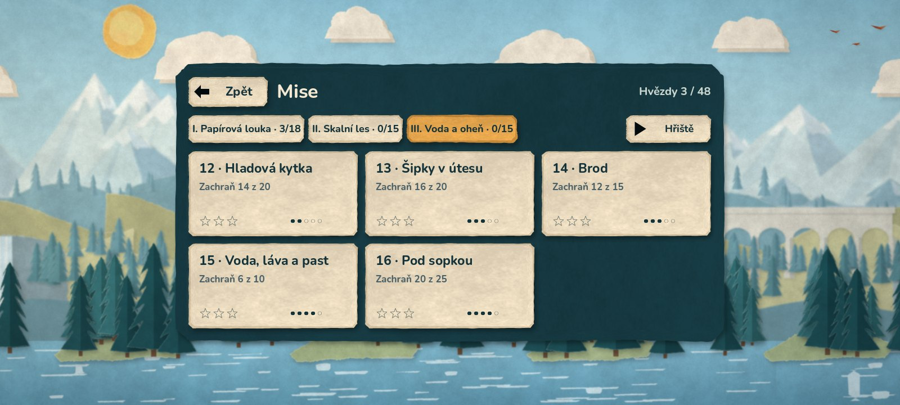

# Android demo 0.9.0

Vývojové APK s **kapitolou III Voda a oheň** (nové mise Hladová kytka,
Šipky v útesu, Brod a Pod sopkou), kapitolami I a II, hvězdami,
úvodními kartami misí, nápovědou a Hřištěm (etapa 9, 16 misí), dále
menu, ukládáním postupu, origami grafikou a zvuky. Hudba přijde později.
Popis změn: [etapa 9](ETAPA_9_OVERENI.md), [herní design](HERNI_DESIGN.md),
[etapa 6](ETAPA_6_OVERENI.md), [zvuky](ZVUK.md).



## Stažení a instalace

[Stáhnout APK z GitHubu](https://github.com/JendaNDT/Lemmings-2026/raw/refs/heads/downloads/android-0.9.0/android/Lemmings-2026-Android-0.9.0.apk) (61 MiB).

Soubor `Lemmings-2026-Android-0.9.0.apk` je v samostatné větvi
`downloads/android-0.9.0`, spolu s návodem a SHA-256 kontrolním součtem.
Starší APK zůstávají ve větvích `downloads/android-0.8.0` a dřívějších.
Stáhnout na telefon nebo tablet, otevřít a případně povolit instalaci
z použitého prohlížeče či správce souborů. Hra se jmenuje
**Lemmings 2026 Demo** a běží na šířku.

**Aktualizace z 0.5.0 až 0.8.0** proběhne přímo (stejný testovací
podpis) a uložený postup i hvězdy zůstanou. Z verze 0.4.0 a starší je potřeba
nejdřív odinstalovat (jiný podpis).

Mise se odemykají postupně; kdo už splnil „První kroky“ (mise 6), má
otevřenou první misi kapitoly II. Kdo splnil Cestu skrz zeď (teď mise 9),
má otevřené i nové mise před ní. Všechny mise hned otevře
**Nastavení → Hra → Všechny mise odemčené**.

- Android 7.0 / API 24 a novější, OpenGL ES 3.0.
- Architektury `arm64-v8a` a `armeabi-v7a` v jednom APK.
- Verze 0.9.0, versionCode 10, balíček `org.lemmings2026.demo`.
- Target SDK 36; aplikace nepožaduje žádná Android oprávnění.
- Testovací podpis, schémata v2/v3. Není určený pro vydání do Google Play;
  soukromý klíč je mimo repozitář i předávané artefakty.
  Certifikát SHA-256 (stejný jako 0.5.0–0.8.0, ověřuje ho export):
  `fdb924fa25c6dfec478caa66dd8ba03ec91909d475de240d9213a50f6681407f`.

SHA-256 APK: `a992b724cd0cace83d03e1b0cbc8f804501f1cc8a288d5f8fa1b1673327e236e`.

## Ovládání a profil

Aplikace začíná hlavním menu (Začít hrát / Pokračovat, Mise, Nastavení).
Tlačítko **Zpět** v menu vrací o úroveň výš a z hlavního menu aplikaci
zavře; ve hře otevře pauzovací menu (Pokračovat, Začít znovu, Nastavení,
Výběr misí, Hlavní menu). Postup, nastavení a rozehraná mise se ukládají
i při přechodu aplikace na pozadí.

Klepnutí na dovednost a potom na postavu přidělí příkaz. Posun jedním prstem
posouvá kameru, dva prsty ji posouvají i přibližují. Dovednost se přidělí
až při uvolnění prstu bez významného pohybu. Emulovaná myš nevytvoří druhý
příkaz. Dotyky začaté na HUDu se nepřenesou do herní plochy.

Mise se vybírají v menu (karty se zámky). Osm dovedností se vejde
na společný spodní řádek. Reproduktor vpravo v liště zvuk ztlumí (volba
se pamatuje). **Odpálit vše** vyžaduje potvrzení; v dialogu se čas zastaví
a klepnutí nepřidělí dovednost postavě pod oknem.

Dotykový výběr má širší dosah (v nastavení Běžný / Velký) a vybírá
nejbližší postavu, které lze aktuální dovednost přidělit. Přechod na pozadí
vždy hru pozastaví a vymaže rozpracovaná gesta. Obnovení pohybu zůstává
na hráči. Telefon začíná na střední kvalitě efektů; počítadlo FPS
a velikost rozhraní jsou v Nastavení → Zobrazení.

Android používá Compatibility / OpenGL ES 3, návrhový viewport 1280 × 720
a vypnuté 2D MSAA. Herní logika se podle platformy nevětví.

## Ověření a omezení

- Před exportem prošla kompletní kontrola `python scripts/check.py`:
  76 GDScriptů, 13 sad, 380 kontrol (simulace, kampaň, hvězdy, úvodní
  karta, ukládání, menu, dotyk, zvuky, obtížnost misí). Report obtížnosti:
  všech 16 misí v cílovém pásmu, každá má ověřené referenční řešení.
- Export ověřil otisk podpisového klíče a hotové APK apksignerem (v2/v3,
  stejný certifikát jako 0.5.0–0.8.0); zarovnání `zipalign -c 4`,
  manifest (0.9.0 / 10, API 24/36, žádná oprávnění), licence písma OFL,
  origami a zvuků. Testy, dokumentace ani skripty se nebalí.
- Herní soubory vytažené přímo z APK prošly v Linuxu (Compatibility,
  softwarový llvmpipe, dotykový profil 20 : 9) celým průchodem
  `scripts/qa_menu.gd`: úvodní karta, mise 1 vyhraná 10/10 klepnutím,
  výsledek s hvězdami, další mise, pauza s nápovědou, nastavení, odchod
  s rozehraným pokusem a nové spuštění s obnovou; kampaň v balíčku má
  16 misí a kapitoly II a III ukazují po pěti kartách.

Linuxové spuštění nepotvrzuje instalaci ani běh Android Activity.
Nativní výkon, systémové tlačítko Zpět a čitelnost karet na malém
displeji ověří až telefon.

## Opakování exportu

Použít Godot 4.7 stable a stejné Android exportní šablony (ověřené SHA-512).
V nastavení editoru vyplnit Android SDK a Java SDK. Pro APK bez Gradlu stačí
Java 21 a nástroje `apksigner` a `zipalign` z Build Tools; v cloudu 0.5.0
a 0.6.0 byly oficiální balíčky Googlu nedostupné, proto posloužily balíčky Ubuntu
`apksigner` a `zipalign` vložené do adresáře SDK (`build-tools/35.0.1`).

```bash
python scripts/check.py
bash scripts/export_android.sh
```

Výstup je `build/android/Lemmings-2026-Android.apk`. Testovací klíč je
mimo projekt (`~/.local/share/godot/keystores/debug.keystore`). Skript
ověří jeho otisk proti `scripts/android_signing.txt` a s jiným klíčem
skončí chybou – jinak by nová verze nešla nainstalovat přes starou.
Klíč zatím žije jen v aktuálním cloudovém prostředí; pro produkční
distribuci připravit samostatný spravovaný podpis.

Grafický průchod menu a misí v dotykovém profilu na Linuxu:

```bash
godot --path . --rendering-driver opengl3 --resolution 1600x720 --fixed-fps 20 \
  --script res://scripts/qa_menu.gd -- --capture-dir=build/menu --mobile --mobile-preview
```

Varování llvmpipe o V-Sync a desktopovém 2D MSAA při přepnutí rendereru
jsou zaznamenaná; Android profil MSAA vypíná. Výsledky neuvádějí FPS telefonu.
