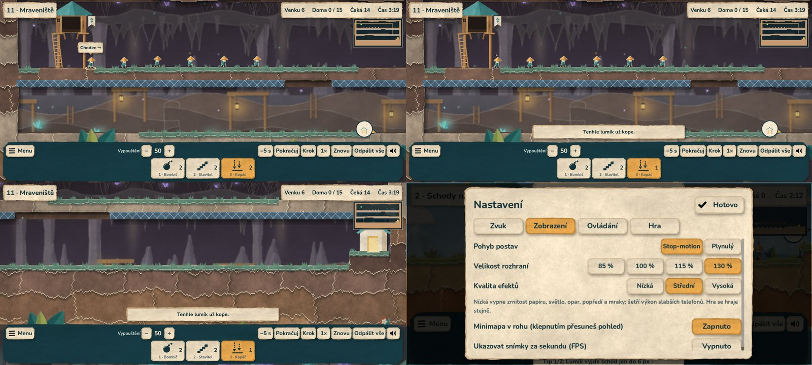

# Android demo 0.15.0

Vývojové APK s **pomocí při hraní** (etapa 10): hláška, proč dovednost
nejde dát, štítek nad lumíkem (co dělá, kolik jich je v davu), náhled
cíle při držení prstu a **minimapa** v rohu. Dál má **čtyři patrové mise v podzemí** (jedna v každé
kapitole, kampaň má 24 misí) a novým prostředím jeskyně a dolu,
**přeletem mapy** na začátku mise a **šipkou k východu** mimo záběr, vlastním vzhledem
každé kapitoly (louka, skalní les, sopka s jiskrami, bouřka s deštěm
a blesky), přetočením o 5 s, pomocníky (krok o tik, zpomalení ½×, ukázka
řešení každé mise) a **celou kampaní – 24 misí ve čtyřech kapitolách**
s hvězdami, úvodními kartami misí, nápovědou a Hřištěm (etapa 9), dále
menu, ukládáním postupu, origami grafikou a zvuky. Hudba přijde později.
Popis změn: [etapa 10](ETAPA_10_OVERENI.md), [etapa 9](ETAPA_9_OVERENI.md), [herní design](HERNI_DESIGN.md),
[etapa 6](ETAPA_6_OVERENI.md), [zvuky](ZVUK.md).



## Stažení a instalace

[Stáhnout APK z GitHubu](https://github.com/JendaNDT/Lemmings-2026/raw/refs/heads/downloads/android-0.15.0/android/Lemmings-2026-Android-0.15.0.apk) (70 MiB).

Soubor `Lemmings-2026-Android-0.15.0.apk` je v samostatné větvi
`downloads/android-0.15.0`, spolu s návodem a SHA-256 kontrolním součtem.
Starší APK zůstávají ve větvích `downloads/android-0.14.0` a dřívějších.
Stáhnout na telefon nebo tablet, otevřít a případně povolit instalaci
z použitého prohlížeče či správce souborů. Hra se jmenuje
**Lemmings 2026 Demo** a běží na šířku.

**Aktualizace z 0.5.0 až 0.14.0** proběhne přímo (stejný testovací
podpis) a uložený postup i hvězdy zůstanou. Z verze 0.4.0 a starší je potřeba
nejdřív odinstalovat (jiný podpis).

Mise se odemykají postupně; kdo už splnil „První kroky“ (mise 6), má
otevřenou první misi kapitoly II. Kdo splnil Cestu skrz zeď (teď mise 9),
má otevřené i nové mise před ní. Všechny mise hned otevře
**Nastavení → Hra → Všechny mise odemčené**.

- Android 7.0 / API 24 a novější, OpenGL ES 3.0.
- Architektury `arm64-v8a` a `armeabi-v7a` v jednom APK.
- Verze 0.15.0, versionCode 16, balíček `org.lemmings2026.demo`.
- Target SDK 36; aplikace nepožaduje žádná Android oprávnění.
- Testovací podpis, schémata v2/v3. Není určený pro vydání do Google Play;
  soukromý klíč je mimo repozitář i předávané artefakty.
  Certifikát SHA-256 (stejný jako 0.5.0–0.14.0, ověřuje ho export):
  `fdb924fa25c6dfec478caa66dd8ba03ec91909d475de240d9213a50f6681407f`.

SHA-256 APK: `5c90c7a5acbea961e94276c7da4c4e8c43d72626f4eda0bd4fb2713bc8218734`.

## Ovládání a profil

Aplikace začíná hlavním menu (Začít hrát / Pokračovat, Mise, Nastavení).
Tlačítko **Zpět** v menu vrací o úroveň výš a z hlavního menu aplikaci
zavře; ve hře otevře pauzovací menu (Pokračovat, Začít znovu, Nastavení,
Výběr misí, Hlavní menu). Postup, nastavení a rozehraná mise se ukládají
i při přechodu aplikace na pozadí.

Po úvodní kartě začne **přelet mapy**: kamera ukáže východ se štítkem
„Východ“ a přeletí k líhni, čas mise mezitím stojí. Klepnutí kamkoli (nebo
Zpět) přelet přeskočí a nic nepřidělí; vypnout jde v Nastavení → Hra.
Za hry ukazuje papírový odznak u okraje směr k východu, když není vidět.

Pomocníci: tlačítko **−5 s** vrátí hru o pět sekund (pozdější příkazy
zmizí, kamera zůstane na místě), v pauze tlačítko **Krok** posune hru o jeden
tik, tlačítko rychlosti přepíná 1× → 3× → ½× a pauzovací menu nabízí
**Ukázku řešení** (přehraje řešení mise, postup nezapisuje).

Klepnutí na dovednost a potom na postavu přidělí příkaz. Posun jedním prstem
posouvá kameru, dva prsty ji posouvají i přibližují. Dovednost se přidělí
až při uvolnění prstu bez významného pohybu. Emulovaná myš nevytvoří druhý
příkaz. Dotyky začaté na HUDu se nepřenesou do herní plochy.

Mise se vybírají v menu (karty se zámky). Osm dovedností se vejde
na společný spodní řádek. Reproduktor vpravo v liště zvuk ztlumí (volba
se pamatuje). **Odpálit vše** vyžaduje potvrzení; v dialogu se čas zastaví
a klepnutí nepřidělí dovednost postavě pod oknem.

Dotykový výběr má širší dosah (v nastavení Běžný / Velký) a vybírá
nejbližší postavu, které lze aktuální dovednost přidělit. Dokud prst drží
na ploše bez posunu, postava, kterou klepnutí zasáhne, se zvýrazní a štítek
nad ní ukáže, co dělá, kolik lumíků je v davu a případně proč jí vybraná
dovednost nejde dát. Když přidělení nevyjde, hláška nad lištou řekne proč
(„Tenhle lumík už kope.“, „Ve vzduchu jde dát jen lezec, padák nebo
bomba.“, „Kopáč: už nezbývá žádný.“).

**Minimapa** v pravém horním rohu ukazuje celou misi, lumíky a rámeček
záběru; klepnutí nebo tažení po ní přesune pohled a nic nepřidělí.
Vypnout jde v Nastavení → Zobrazení. Přechod na pozadí
vždy hru pozastaví a vymaže rozpracovaná gesta. Obnovení pohybu zůstává
na hráči. Telefon začíná na střední kvalitě efektů; počítadlo FPS
a velikost rozhraní jsou v Nastavení → Zobrazení.

Android používá Compatibility / OpenGL ES 3, návrhový viewport 1280 × 720
a vypnuté 2D MSAA. Herní logika se podle platformy nevětví.

## Ověření a omezení

- Před exportem prošla kompletní kontrola `python scripts/check.py`:
  89 GDScriptů, 16 sad, 440 kontrol (simulace, kampaň, hvězdy, úvodní
  karta, ukládání, menu, dotyk, zvuky, obtížnost misí, pomocníci,
  přetočení, vzhled kapitol a podzemí, přelet mapy, důvody odmítnutí,
  štítek, náhled cíle a minimapa). Maraton celé kampaně v jedné aplikaci
  (`scripts/soak.gd`) bez úniku uzlů a paměti. Report obtížnosti:
  všech 24 misí v cílovém pásmu, každá má ověřené referenční řešení.
- Export ověřil otisk podpisového klíče a hotové APK apksignerem (v2/v3,
  stejný certifikát jako 0.5.0–0.14.0); zarovnání `zipalign -c 4`,
  manifest (0.15.0 / 16, API 24/36, žádná oprávnění), licence písma OFL,
  origami a zvuků. Testy, dokumentace ani skripty se nebalí.
- Herní soubory vytažené přímo z APK prošly v Linuxu (Compatibility,
  softwarový llvmpipe, dotykový profil 20 : 9) celým průchodem
  `scripts/qa_menu.gd`: úvodní karta, přelet mapy přeskočený kliknutím,
  mise 1 vyhraná 10/10 klepnutím,
  výsledek s hvězdami, další mise, pauza s nápovědou, nastavení, odchod
  s rozehraným pokusem a nové spuštění s obnovou; kampaň v balíčku má
  24 misí a všechny čtyři záložky kapitol se vejdou i v profilu 20 : 9.
  Z týchž souborů proběhla i Ukázka řešení mise Propadlo (9 z 10 =
  mistrovský výsledek), Krok, zpomalení a lišta s −5 s. První mise každé
  kapitoly se z balíčku spustila se svým vzhledem (louka, les, sopka,
  bouřka) – krajiny všech témat jsou v APK. Přelet finále z balíčku
  trval 3,9 s a skončil na startovním záběru; šipka pak ukazuje
  k východu u pravého okraje. Všechny čtyři patrové mise se z balíčku
  spustily v prostředí podzemí a mají záznam pro Ukázku řešení.
- APK 0.15.0 z týchž souborů: menu na počítači i v dotykovém profilu
  (24 misí, mise 1 vyhraná 10/10); v Mraveništi držený prst ukázal štítek
  „Chodec →“, uvolnění přidělilo kopáče, druhé klepnutí nic nepřidělilo
  a hláška řekla „Tenhle lumík už kope.“; přesun pohledu přes minimapu.
  `scripts/qa_resolutions.gd` z balíčku: pět mobilních obrazovek
  (16:9, 20:9, 19,5:9, 16:10, 4:3) po 100 % i 130 % bez překryvů.
  Hlášky ALSA a „resources still in use“ při ukončení způsobuje jen
  chybějící zvuková karta v cloudu (s ovladačem Dummy zmizí).

Linuxové spuštění nepotvrzuje instalaci ani běh Android Activity.
Nativní výkon, systémové tlačítko Zpět a čitelnost karet na malém
displeji ověří až telefon.

## Opakování exportu

Použít Godot 4.7 stable a stejné Android exportní šablony (ověřené SHA-512).
V nastavení editoru vyplnit Android SDK a Java SDK. Pro APK bez Gradlu stačí
Java 21 a nástroje `apksigner` a `zipalign` z Build Tools; v cloudu 0.5.0
a 0.6.0 byly oficiální balíčky Googlu nedostupné, proto posloužily balíčky Ubuntu
`apksigner` a `zipalign` vložené do adresáře SDK (`build-tools/35.0.1`).

```bash
python scripts/check.py
bash scripts/export_android.sh
```

Výstup je `build/android/Lemmings-2026-Android.apk`. Testovací klíč je
mimo projekt (`~/.local/share/godot/keystores/debug.keystore`). Skript
ověří jeho otisk proti `scripts/android_signing.txt` a s jiným klíčem
skončí chybou – jinak by nová verze nešla nainstalovat přes starou.
Klíč zatím žije jen v aktuálním cloudovém prostředí; pro produkční
distribuci připravit samostatný spravovaný podpis.

Grafický průchod menu a misí v dotykovém profilu na Linuxu:

```bash
godot --path . --rendering-driver opengl3 --resolution 1600x720 --fixed-fps 20 \
  --script res://scripts/qa_menu.gd -- --capture-dir=build/menu --mobile --mobile-preview
```

Varování llvmpipe o V-Sync a desktopovém 2D MSAA při přepnutí rendereru
jsou zaznamenaná; Android profil MSAA vypíná. Výsledky neuvádějí FPS telefonu.
