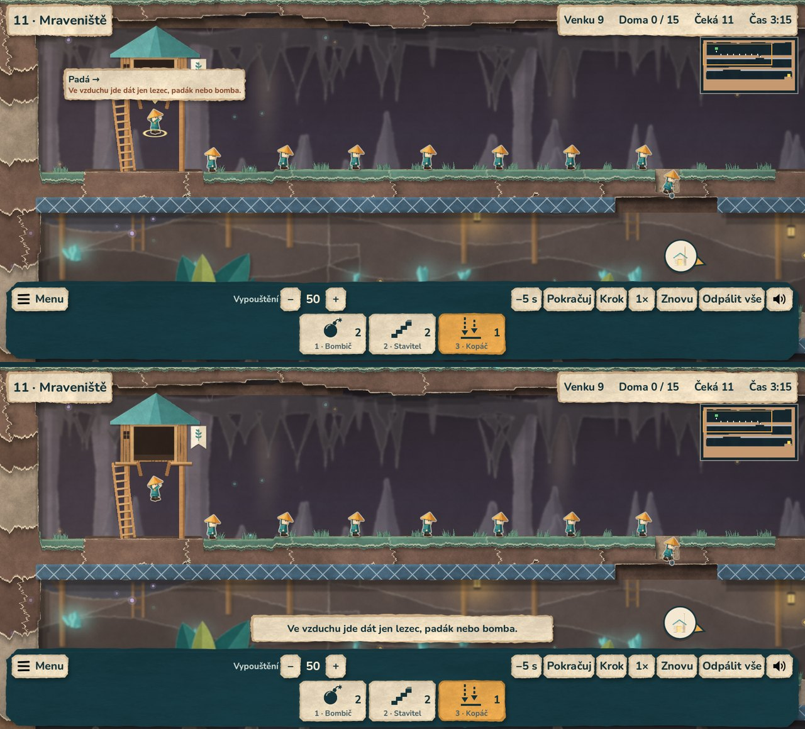

# Etapa 10 – pohodlí a betatest: ověření

4. října 2026. Podle [plánu vývoje](PLAN_VYVOJE.md) (etapa 10): výběr v davu,
zvýraznění cíle, vysvětlení nedostupných dovedností, minimapa a prověření
dlouhého hraní, přechodů, rozlišení, ukládání a výkonu. Ladění obtížnosti
podle hraní autora zůstává otevřené (čeká na zkušenost z telefonu).

## Krok 1 – proč dovednost nejde a náhled cíle

- **Důvody odmítnutí** počítá simulace (`SkillRules.refusal()`, čistá
  logika v `sim/`): došly kusy, umírá nebo je doma, trvalou vlastnost nebo
  bombu už má, padá / leze / blokuje (pracovní dovednost nejde), tu práci
  už dělá. `LevelSim.can_assign()` je jen zkratka „důvod = žádný“ – test
  porovnal staré a nové pravidlo ve 32 656 situacích celého finále
  (9 stavů lumíků) beze změny.
- **Hláška** nad lištou (2,4 s, pak zmizí) po neúspěšném klepnutí nebo
  kliknutí: „Tenhle lumík už kope.“, „Blokař se už nehne – dát mu jde jen
  bomba, lezec nebo padák.“, „Ve vzduchu jde dát jen lezec, padák nebo
  bomba.“ Klepnutí na dovednost, které už nezbývá: „Kopáč: už nezbývá žádný.“
- **Štítek nad lumíkem** pod kurzorem (počítač) nebo pod prstem, dokud
  prst drží bez posunu (telefon): co dělá a kam jde („Chodec →“), trvalé
  vlastnosti (lezec, padák, bomba), kolik lumíků je v davu pod prstem
  a hnědě důvod, proč mu vybraná dovednost nejde dát. Lumík, kterého
  klepnutí zasáhne, se zvýrazní ještě před uvolněním prstu (výběr v davu).
  Posun prstem náhled zruší.
- Nápověda kláves v nastavení doplněná o tečku (krok) a Backspace (−5 s).

## Krok 2 – minimapa

- V pravém horním rohu herní plochy: celá mise zmenšená (terén, ocel,
  voda, láva), líheň, východ, pasti, lumíci a rámeček záběru kamery.
- Klepnutí nebo tažení po minimapě přesune pohled. Dotyk začatý na
  minimapě nepatří herní ploše (nic nepřidělí). Při přeletu mapy se
  pohled nepřesouvá.
- Obraz terénu se po změně masky obnoví nejvýš 4× za sekundu (vzorkuje
  střed čtverce 2–4 px). Na obrazovce má stále stejnou velikost i při
  zvětšeném rozhraní. Vypnout jde v **Nastavení → Zobrazení → Minimapa**.

## Krok 3 – odolnost a výkon

**Maraton** (`scripts/soak.gd`): jedna instance aplikace odehraje celou
kampaň podle referenčních řešení – v každé misi úvodní karta, přelet,
kousek hry a restart, mezi misemi tlačítko „Další“, po každé kapitole
návrat do menu. Výsledek: **24/24 misí s mistrovským výsledkem za 37 s**,
na disku celá kampaň se 72 hvězdami. Opakovaný návrat do menu nepřidá
žádný uzel (358 / 424 / 490 / 534 – nárůst odpovídá jen novým hvězdám
a tečkám na odemčených kartách), osiřelé uzly 0, statická paměť v menu
100,5 → 102,2 MB za celou kampaň.

**Rozlišení** (`scripts/qa_resolutions.gd`): výběr misí a hra s osmi
dovednostmi, rozhraní 100 % i 130 %. Tlačítka celá na obrazovce, v liště
se nepřekrývají, název se nepřekrývá se stavem, minimapa nezakrývá stav.

| Profil | Okno | 100 % | 130 % |
|---|---|---|---|
| 16:9 počítač | 1600 × 900 | OK | OK |
| 16:10 MacBook | 1440 × 900 | OK | OK |
| 21:9 široký | 2520 × 1080 | OK | OK |
| 4:3 monitor | 1024 × 768 | OK | OK |
| 16:9 telefon | 1280 × 720 | OK | OK (po opravě) |
| 20:9 telefon | 1600 × 720 | OK | OK (po opravě) |
| 19,5:9 telefon | 1560 × 720 | OK | OK (po opravě) |
| 16:10 tablet | 1280 × 800 | OK | OK (po opravě) |
| 4:3 tablet | 1024 × 768 | OK | OK |

- **Nalezená chyba:** po přidání sedmé mise do kapitoly I se na telefonu
  s rozhraním 130 % nevešla poslední karta (První kroky) a výběr misí se
  neposouval. Karty se teď na nízké obrazovce zmenší (150 → nejméně
  104 px) a hvězdy se posunou níž.
- Minimapa při rozhraní 130 % zabírala na telefonu velkou část plochy;
  teď má na obrazovce stejnou velikost jako při 100 %.

**Výkon** (cloud, 1280 × 720, software llvmpipe): `_process` = logika
a aktualizace zobrazení za snímek při 60 FPS.

| Mise | Lumíků | Kvalita | `_process` ms průměr / 95 % |
|---|---|---|---|
| Origami finále | 40 | vysoká / střední | 2,65 / 4,35 · 2,68 / 4,10 |
| Mlýnský spěch | 40 | vysoká / střední | 2,36 / 3,93 · 2,42 / 3,96 |
| Dvě líhně (déšť) | 17 | vysoká / střední | 2,07 / 2,93 · 1,77 / 2,74 |
| Hluboká šachta (podzemí) | 25 | vysoká / střední | 1,91 / 2,70 · 2,00 / 2,96 |
| Velký sestup | 24 | vysoká / střední | 2,58 / 3,70 · 2,43 / 3,76 |

Logika i aktualizace se vejdou do 5 ms ze 16,7 ms snímku. Celé snímky
s vykreslováním (130–190 ms) jsou jen softwarový renderer cloudu bez
grafické karty – výkon vykreslování na telefonu ověří až telefon.
Statická paměť ve hře 46–52 MB.

**Ukládání a aktualizace:** nastavení ze starší verze (bez přeletu
a minimapy) se načte s novými volbami zapnutými a ostatní volby zůstanou;
postup podle id misí přežil vložení čtyř patrových misí (test_save).

## Ověření

- Nová sada `tests/test_comfort.gd` (18 kontrol): důvody odmítnutí,
  shoda se starým pravidlem, dav v bodě, české hlášky, náhled cíle při
  držení prstu, přidělení po uvolnění, hláška při odmítnutí, dav pod
  prstem, posun ruší náhled, prázdná dovednost, zmizení hlášky; minimapa
  (přehled a rámeček, klepnutí přesune pohled, obnova po změně terénu,
  dotyk na minimapě nepatří hře, vypnutí).
- `test_save`: nastavení ze starší verze.
- Celá kontrola `python scripts/check.py`: **89 GDScriptů, 16 sad,
  440 kontrol, vše v pořádku** (Godot 4.7 stable, ověřený SHA-512).
- APK 0.15.0: herní soubory z balíčku prošly průchodem menu (počítač
  i telefon), štítkem, hláškou a minimapou v Mraveništi a kontrolou
  rozlišení v dotykovém profilu ([Android demo](ANDROID_DEMO.md)).

## Meze

- Telefon: čitelnost štítku a minimapy, výkon vykreslování a pohodlí
  náhledu cíle zatím nikdo nezkoušel.
- Minimapa v pravém horním rohu může zakrýt kousek mapy (třeba střechu
  východu u pravého okraje); kdo ji nechce, vypne ji v nastavení.
- Výběr jen lumíků jdoucích jedním směrem (jako NeoLemmix) zatím není –
  podle testování.
