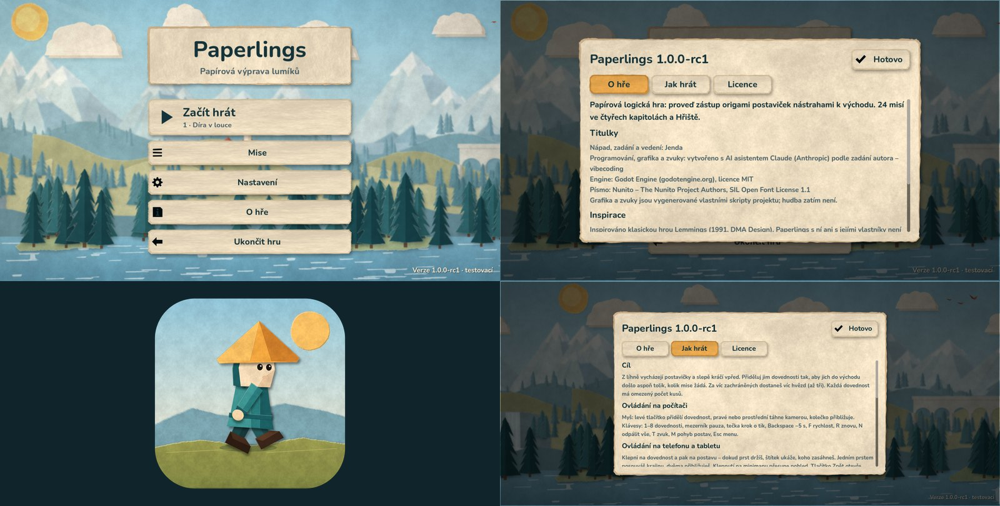

# Etapa 11 – vydání 1.0: ověření

4. října 2026. Podle [plánu vývoje](PLAN_VYVOJE.md) (etapa 11): veřejný
název, ikona, titulky, licence, návod a známá omezení, opakovatelné exporty,
verzování a distribuce, hlášení chyb a zachování postupu při aktualizaci.
Test na skutečných Windows dělá autor ([kontrolní seznam](TEST_WINDOWS.md)).

## Rozhodnutí autora

- **Název:** Paperlings. Před výběrem jsme prohledali web – hru s tímto
  jménem jsme nenašli (jen pojem z fanouškovské wiki Splatoonu). Nejde
  o úřední rešerši ochranných známek.
- **Distribuce:** GitHub Releases. **Licence:** volně ke hraní, ostatní
  práva vyhrazena. **Titulky:** „Jenda“.

## Krok 1 – název a zachování postupu

- Okno, menu, Android štítek, soubory exportu a Windows/macOS metadata
  nesou jméno Paperlings. Interní ID zůstala: balíček
  `org.lemmings2026.demo` (aktualizace přes testovací APK), značka
  formátu uložených dat a `level_id` misí.
- Na počítači má hra vlastní složku dat `Paperlings`
  (`%APPDATA%\Paperlings`, `~/Library/Application Support/Paperlings`,
  `~/.local/share/Paperlings`). `SaveMigration` při prvním spuštění jednou
  zkopíruje postup a nastavení ze staré `…/app_userdata/Lemmings 2026`,
  jen když nová složka žádná data nemá; originál zůstane. Značka
  `prenos_dat.txt` zabrání opakování (třeba po „Smazat postup“).
- Ověřeno naostro: postup se třemi splněnými misemi ve staré složce →
  spuštění hry → v nové složce 3 splněné mise a ★★★ u první.

## Krok 2 – ikona

Generátor `assets/origami/source/build_icon.py` skládá ikonu ze stejných
dílů postavičky jako hra (3× rozlišení) na papírovém kopci: PNG 1024/256,
Android 192 + adaptivní 432 (pozadí, popředí v bezpečném kruhu, bílá
silueta pro motivy Androidu 13+), `.ico` (16–256 px) a `.icns`. Ikona je
v okně, na úvodní obrazovce, v APK (všechny hustoty), v `Paperlings.exe`
(6 ikon + údaje o verzi, firmě a autorských právech) a v balíčku macOS.
Ostatní podklady origami sady se regenerací nezměnily (128 souborů v manifestu).
Stará zástupná ikona ve stylu původní hry je pryč.

## Krok 3 – O hře, licence, návod a hlášení chyb

- **O hře** v hlavním menu: titulky (Jenda, AI asistent Claude, Godot,
  Nunito), vymezení vůči Lemmings, **Jak hrát** (cíl, ovládání na počítači
  i telefonu, 8 dovedností, pomocníci, tipy, známá omezení) a **Licence**
  (licence hry, MIT Godotu, 102 součásti enginu s autory a licencemi, OFL
  písma; plné texty 19 licencí se ukazují po jedné).
- **Nahlásit chybu:** verze, systém, procesor, grafika, obrazovka, jazyk,
  nastavení a postup – bez cest a osobních údajů. Zkopíruje se do schránky
  a otevře formulář `.github/ISSUE_TEMPLATE/chyba.yml` s předvyplněným
  polem *Údaje o zařízení*.
- `LICENSE.txt` (volně ke hraní, ostatní práva vyhrazena, součásti třetích
  stran), licence origami a zvukové sady, [návod pro hráče](NAVOD.md)
  (instalace na Windows/macOS/Android, aktualizace, ovládání, známá
  omezení, hlášení chyb).
- Verze v menu: předběžná (`-rc`) má označení „testovací“.

## Krok 4 – opakovatelné vydání

- **Jedna verze** v `project.godot` (`1.0.0-rc1`). `scripts/release.py`
  z ní odvodí Android versionCode (1 000 001; finální 1.0.0 = 1 000 099),
  čísla souborů Windows (1.0.0.1) a macOS (1.0.0 / 1.0.0.1).
- `python scripts/release.py build`: kontrola, exporty Android (podpis
  hlídá `export_android.sh`), Windows a macOS, balíčky s `LICENSE.txt`,
  `NAVOD.txt` a `THIRD_PARTY_NOTICES.txt` (generuje
  `scripts/third_party_notices.gd`), `SHA256SUMS.txt` a kontrola obsahu.
- Exportní šablony instaluje `scripts/install_templates.py` z oficiálního
  vydání se SHA-512 (Android šablony v prostředí byly shodné s oficiálními).
  `export_desktop.sh` nejdřív importuje podklady (čistý klon).
- **Workflow *Vydání*** (`.github/workflows/release.yml`): push větve
  `vydani/<verze>` (nebo značky `v<verze>`; cloudové prostředí smí pushovat
  jen větve, značku odmítlo s 403) → kontrola a exporty Windows a macOS v GitHub Actions
  z ověřeného Godotu, APK z větve `downloads/android-<verze>` (ověřené
  SHA-256), GitHub Release s poznámkami z `docs/vydani/<verze>.md`
  (rc = předběžné vydání). Vydaná sestavení a zdrojová verze se tak
  uchovávají u značky `v<verze>`, kterou vytvoří GitHub při zveřejnění.

## Krok 5 – kandidát 1.0.0-rc1

| Soubor | Velikost |
|---|---|
| `Paperlings-1.0.0-rc1-Android.apk` | 72,2 MiB |
| `Paperlings-1.0.0-rc1-Windows.zip` | 52,9 MiB |
| `Paperlings-1.0.0-rc1-macOS.zip` | 75,3 MiB |

- Celá kontrola před exportem: **94 GDScriptů, 17 sad, 455 kontrol, vše
  v pořádku** (nová sada `test_about`, přenos dat v `test_save`).
- APK: v2/v3, jeden podpis se stejným certifikátem jako 0.5.0–0.15.0,
  `zipalign`, manifest `org.lemmings2026.demo` 1000001 / 1.0.0-rc1,
  API 24/36, žádná oprávnění, štítek Paperlings, adaptivní ikona.
- Windows: `Paperlings.exe` s ikonou a údaji Paperlings / Jenda / 1.0.0.1.
  macOS: `Paperlings.app` (universal, ad-hoc podpis), Info.plist
  Paperlings 1.0.0, ikona, minimum macOS 11 (arm64) / 10.12 (x86_64).

## Ověření

- Herní data vytažená z hotových balíčků běžela v Linuxu (Compatibility,
  softwarový llvmpipe) – z APK (`assets.sparsepck`), z `Paperlings.exe`
  (vložený balíček) a z `Paperlings.app` (`Paperlings.pck`):
  - `scripts/qa_menu.gd` z APK (dotykový profil 20 : 9) i z Windows
    `.exe`: **MENU_QA OK** – 24 misí, mise 1 vyhraná 10/10, výsledek,
    pauza, nastavení, odchod s rozehraným pokusem a obnova další den.
  - O hře z APK, Windows i macOS: verze 1.0.0-rc1, licence Godotu, písma
    (soubor OFL je v balíčku) i součástí, hlášení začíná „Paperlings 1.0.0-rc1“.
- `test_about` (11 kontrol): tlačítko v menu, záložky, texty titulků,
  licencí a návodu (všech 8 dovedností), plný text licence po klepnutí,
  hlášení bez cest a osobních údajů, odkaz s předvyplněnými údaji, Zpět.
- `test_save`: přenos ze staré složky, značka po smazání postupu,
  nepřepsání nových dat, složka `Paperlings`.

## Meze

- Windows a macOS sestavení zatím nikdo nespustil na skutečném počítači;
  v cloudu se spouštějí jen jejich herní data přes Linux. Windows test
  dělá autor, macOS zůstává neověřený.
- Sestavení nejsou podepsaná certifikátem Microsoftu ani Applu
  (SmartScreen a Gatekeeper napoprvé varují; postup je v návodu).
- Podpisový klíč Androidu žije jen v cloudu (viz PROJECT_STATUS).
- Hlášení chyb vyžaduje účet na GitHubu; údaje jdou poslat i jinak
  (jsou ve schránce).
