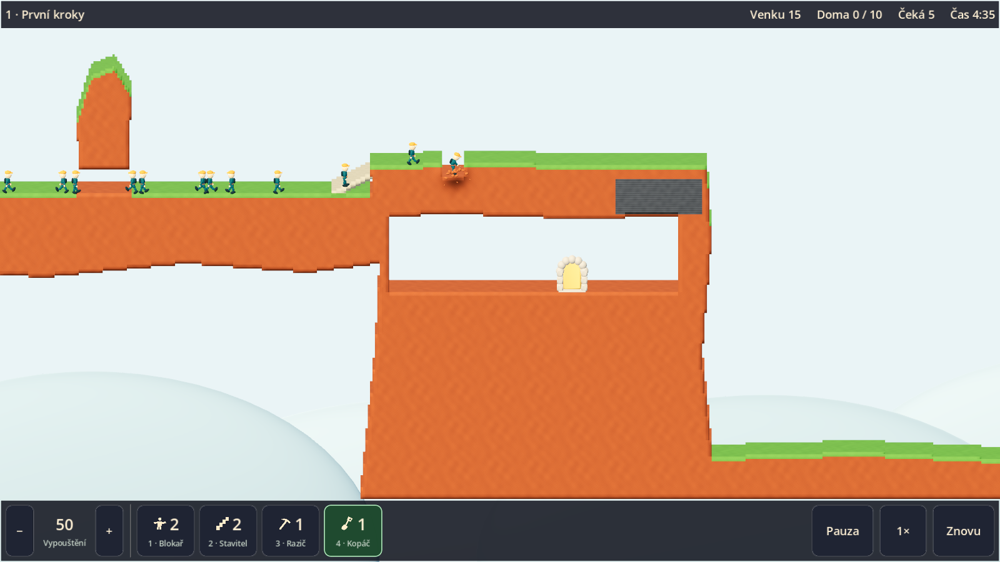

# Etapa 3 — hratelný 2.5D prototyp

Dokončeno v cloudu 2. října 2026. Výchozí scéna je `main/game_3d.tscn`.
Celý první level funguje s prostorovým terénem, postavami, animacemi,
světlem, kamerou a původním HUD. Grafický průchod zachránil **20 z 20**.

## Provedená implementace

- Ověřeno a přeneseno 50 souborů první modelínové sady. Kontrolní manifest
  je v `assets/clay.lock.json`; u materiálů eviduje původní i odvozený hash
  po přizpůsobení cest. Lokální game-dev CLI nebylo dostupné, proto je
  příjem ověřen vlastní kontrolou kompletního manifestu původního ZIPu.
- Prostorový terén vzniká ze skutečné masky: přední a zadní plochy,
  boky, jeskyně, oddělené ostrůvky, ocel a cihly. Má hloubku 2,4 m.
- Mapa je rozdělená na oblasti 32 × 32 buněk. Mění se pouze zasažené
  oblasti a nezbytní sousedé. Povrch přes švy používá stejné souřadnice
  textur a stejnou masku pro zaoblené stínování hran.
- Postavička používá GLB s kostrou. Pózy se hledají podle simulačních tiků,
  při práci se připojují nástroje. Pauza i zrychlení zachovávají časování.
- Kopání mění skutečnou geometrii, shader přidává lokální promáčknutí
  normál a světla, hrudky se protahují a odlétají. Nejde o soft-body fyziku.
- Ortografická kamera má pevný sklon, zoom, posun klávesami, okrajem
  a tažením myši. Kliknutí se promítá do roviny postav a používá stejné
  logické rozhodování o cíli jako 2D scéna.
- Původní `main/game.tscn` je zachovaná. Obě scény sdílejí `main/game.gd`
  a stejnou simulaci, dovednosti i herní příkazy.

## Automatické kontroly

Spuštění v připraveném prostředí nebo s Godotem v PATH:

```bash
python scripts/check.py --benchmark
```

Výsledek: **43 GDScriptů, 7 sad, 124 kontrol**. Prošel parser, linter,
import v čisté kopii, původní mechaniky, replay, 2D smyčka, 3D testy,
oba zátěžové scénáře a výchozí spuštění. Protokoly jsou v `build/checks/`.

Nových 34 kontrol ve `tests/test_3d.gd` ověřuje mimo jiné:

- pokrytí každé buňky skutečným meshem, bez překrytí a mezer;
- orientaci trojúhelníků a plochu všech boků proti skutečnému obvodu masky;
- řezy na hranici oblasti, kruhové řezy, cihly a nerozkopatelné materiály;
- nezávislé čtení změn dvěma renderery;
- zpětnou projekci při třech zoomech, tažení i jeho uvolnění nad HUDem;
- přidělení dovednosti přes vstupní událost, pauzu, pracovní kontakt a restart;
- celé řešení prvního levelu a přesnou shodu kompletního stavu s čistou simulací;
- výsledný tunel, schody a svislou šachtu v geometrii.

## Skutečné vykreslování a vstup

Grafický běh používá Godot 4.7, Forward+ a Vulkan s ovladačem llvmpipe
v Linuxovém cloudu. Nejde o nativní GPU MacBooku.

```bash
godot --path . --audio-driver Dummy --resolution 1280x800 \
  --script res://scripts/qa_3d.gd
```

Skript spustí skutečnou herní scénu a pošle události kláves a myši do
vstupní cesty viewportu včetně GUI. Raziče, stavitele ani kopáče nepřiděluje
přímým zápisem do simulace. Uloží šest skutečných snímků a report.
Výsledek: **20 zachráněných, 0 ztracených, 1 014 tiků**, všechny tři
pracovní dovednosti přidělené přes vstup. Stejný průchod byl ověřen
i nad herním PCK vytaženým z finálního macOS balíčku při 1600 × 900.
Tento test potvrzuje zabalený obsah, nikoli běh macOS spustitelného souboru.



## Výkon a meze ověření

CPU: AMD EPYC 9V74. Výsledky jsou měření v cloudu, ne slib FPS na cílovém
zařízení. Čas grafického ovladače není součástí těchto CPU hodnot.

| Scénář | Výsledek |
|---|---|
| Běžné řešení prvního levelu | Přibližně 1,2 ms CPU na 95. percentilu; změna terénu přibližně 4,0 ms |
| Souběžná práce 200 postav, 240 tiků | CPU medián 10,8 ms, 95. percentil 34,7 ms, maximum 48,8 ms |
| Terén při zátěži | 95. percentil 30,1 ms; nejvýše 26 ze 140 oblastí při jednom kroku |
| Optimalizace čtení sousedů | V předběžném zátěžovém měření klesl 95. percentil přestavby přibližně z 67 na 30 ms |

Při běžném řešení se mění nejvýše čtyři oblasti současně. Žádná část hry
nečeká na přestavbu celé mapy. Zátěž 200 postav se souběžnou prací zatím
nedokládá 60 FPS; další optimalizace a nativní měření patří do navazujícího
ladění. Finální grafika celé kampaně, zvuky a Android nejsou součástí etapy 3.

## Předání pro Mac

Verze aplikace je **0.2.0**, univerzální Mach-O pro Apple Silicon a Intel,
ad-hoc podpis bez notarizace. Byla ověřena struktura ZIPu, obě architektury,
verze aplikace a skutečný grafický průchod zabaleného obsahu v Linuxu.
Spuštění přímo na macOS a výkon na MacBooku zatím ověřené nejsou.

V pracovním prostoru jsou výstupy v `/workspace/artifacts/lemmings-phase-3/`:

- `Lemmings-2026-etapa-3-macOS.zip`: samostatná aplikace, Godot není potřeba.
- `Lemmings-2026-etapa-3-projekt.zip`: aktuální projekt včetně podkladů,
  skriptů a dokumentace; rozbalit, importovat `project.godot`, F5.
- `CTI_ME.md`, náhledy, protokoly a `SHA256SUMS.txt`.

Nativní test Windows zůstává podle dohody odložený. Následuje etapa 4:
zbývající dovednosti včetně šikmého kopání horníka. Kopání vzhůru se nezavádí.
