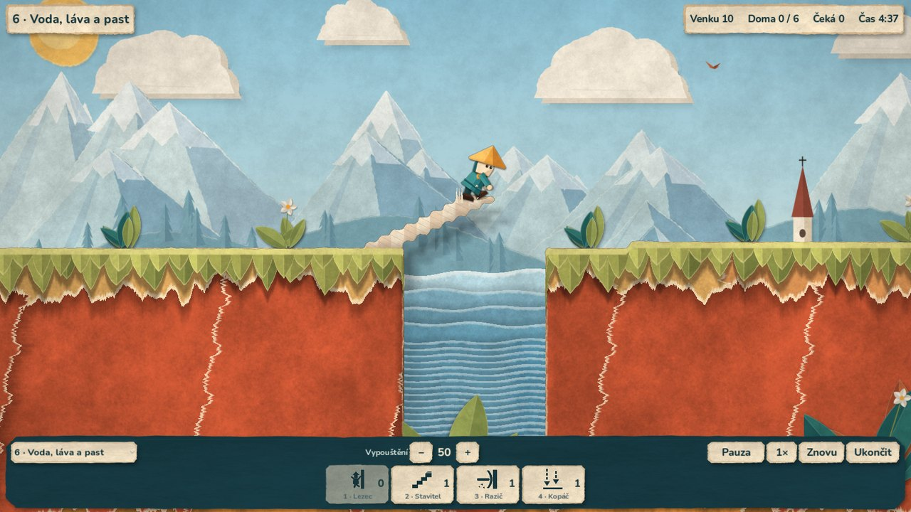
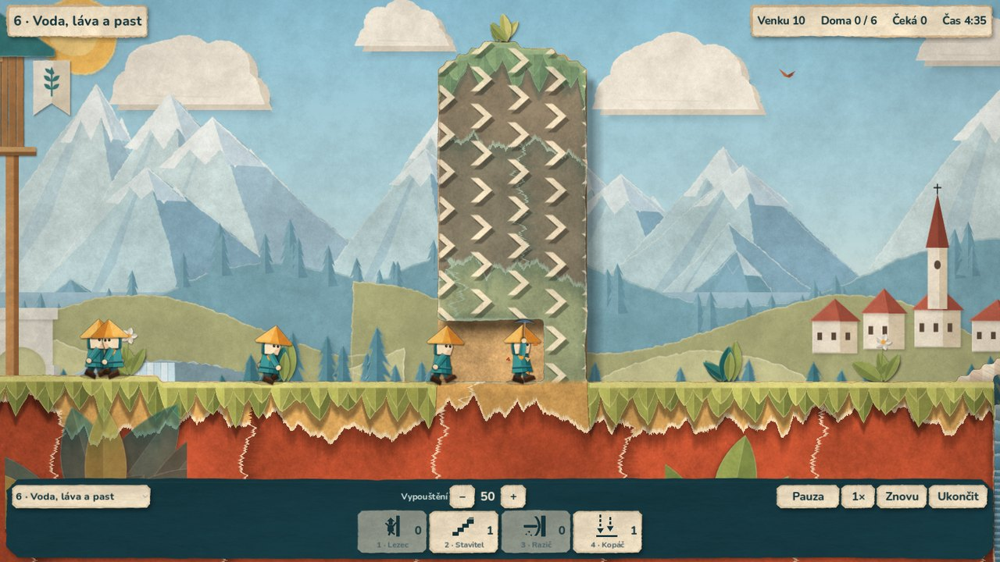
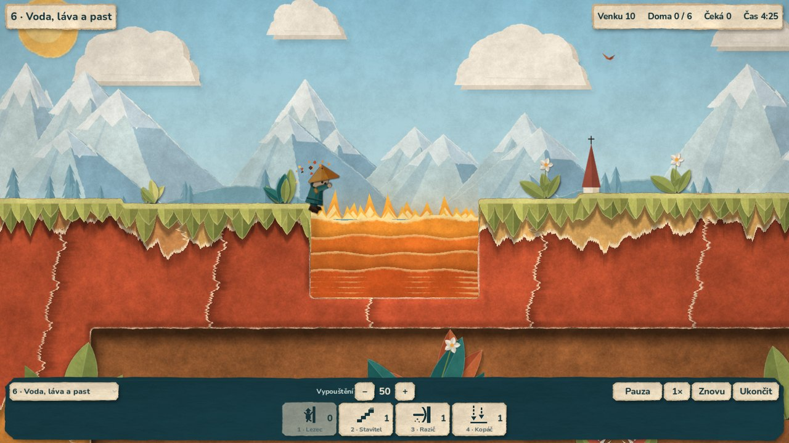
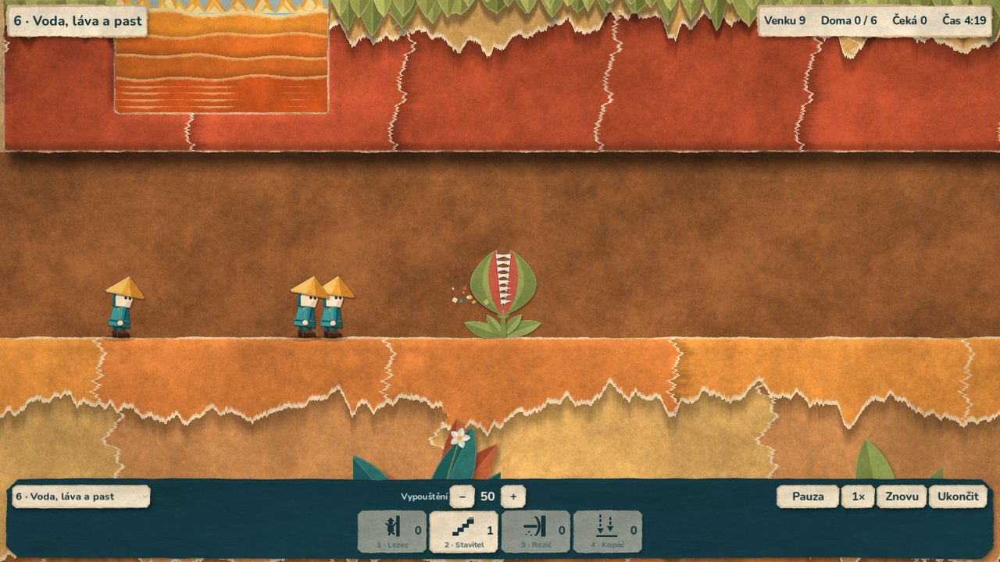
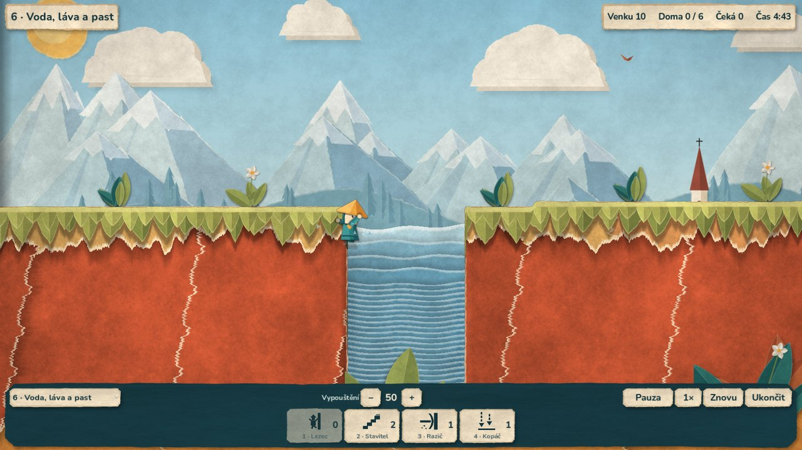

# Etapa 5 — voda, láva, pasti a jednosměrné zdi

3. října 2026. Nová nebezpečí jsou pravidla čisté simulace (`sim/`),
v editoru se skládají bez programování a origami zobrazení je jen čte.
Novou misi „6 · Voda, láva a past“ najdeš v nabídce misí vlevo dole.


Záznam (19 s): [`images/etapa5-mise6.mp4`](images/etapa5-mise6.mp4) —
lezec přeleze zeď se šipkami, most přes vodu, razič ve směru šipek,
kopání vedle lávy a past, která cvakne a pak se znovu otevře.

## Pravidla

| Prvek | Co dělá |
|---|---|
| **Voda** | Lumík, který do ní spadne nebo vejde, se 16 tiků topí a je ztracen. Padák ani lezení nepomůže. Pád 3 px za tik tenkou hladinu nepřeskočí. |
| **Láva** | Stejně, jen hoří (14 tiků). Když se v jednom tiku potká voda i láva, rozhodne láva. |
| **Cihly nad vodou a lávou** | Cihla položená do hladiny je suchá stavba: po mostě se dá přejít. Když cihlu někdo vykope, voda nebo láva je tam znovu. |
| **Past** | Sežere prvního lumíka, jehož nohy vstoupí do spouště (výchozí 10 × 10 px nad bodem pasti). Pak se `rearm_ticks` tiků dobíjí a ostatní projdou. Ze dvou lumíků ve stejném tiku sežere toho, kdo vyšel z líhně dřív. |
| **Jednosměrná zeď** | Pevná zem se šipkami. Razič a horník ji prorazí jen ve směru šipek; proti nim se otočí jako u oceli. Kopáč ani výbuch směr neřeší. Cihla ve vykopaném místě je obyčejná stavba. |
| **Topící se / hořící lumík** | Nepřijme dovednost, odpočet bomby zhasne, hromadné odpálení ho přeskočí. |

**Pořadí v jednom tiku** (pro každého lumíka v pořadí vypuštění):
odpočet bomby → činnost stavu → pád pod level → láva → voda → past → východ.
Nebezpečí se tedy vyhodnotí dřív než východ. Laditelná čísla jsou
v `sim/sim_const.gd` (`DROWN_TICKS`, `BURN_TICKS`, `TRAP_REARM_TICKS`).

Technicky: kanál A masky terénu nese druh buňky (voda, láva, šipky doleva
nebo doprava). Voda a láva jsou prázdné buňky se značkou, jednosměrná zeď je
pevná buňka se značkou. Nové stavy mají vlastní soubory
`sim/states/drowning_state.gd` a `burning_state.gd`.

## Editor

- `TerrainShape` má nové druhy: **Water**, **Lava**, **One Way Left**,
  **One Way Right** (v editoru modře, oranžově a šalvějově).
- Nový uzel **`LemmingTrap`**: postav ho na zem; v Inspectoru je velikost
  spouště a doba dobíjení. Editor ukazuje spoušť jako červený obdélník.
- **Kontrola levelu** (`LevelValidator`): žlutý trojúhelník u kořene levelu
  hlásí chybějící líheň či východ, požadavek vyšší než počet lumíků, líheň
  v terénu nebo nad vodou/lávou, východ ve vzduchu, zasypaný nebo ve vodě,
  past ve vzduchu nebo přes východ. Všech 6 misí prochází bez nálezu.

## Vzhled (origami)

| Prvek | Jak vypadá |
|---|---|
| Voda | vlnité pruhy modrého papíru se světlým vláknitým okrajem (pěna), vlny se pohybují s herním časem |
| Láva | oranžovo-červené pruhy, papírové plameny nad hladinou mění výšku po dvou ticích, teplá záře |
| Jednosměrná zeď | šalvějový papír s nalepenými krémovými šipkami se stínem |
| Past | masožravá rostlina z papíru: dvě čelisti se zuby, cvaknou, „žvýkají“ a před dobitím se zase otevřou |
| Topení | postavička mává rukama a klesá za průsvitné přední pruhy vody, kapky |
| Hoření | poskočí, ztmavne a zmačká se, jiskry a popel |

Přední pruhy vody a lávy se kreslí nad postavami stejnými barvami, takže
ponořená část postavy je „pod hladinou“. Hladina leží přesně na horní hraně
první buňky vody, takže kresba sedí na pravidla. Jeskyně nově poznají
i uzavřené dutiny (chodba v misi 6 má zadní stěnu) a pod vodou ani lávou
neroste mech. 2.5D porovnávací scéna nebezpečí nekreslí (jen nespadne).

| | |
|---|---|
|  |  |
|  |  |



## A. Automatické testy (headless, Linux)

`python scripts/check.py`: **71 GDScriptů, 10 sad, 281 kontrol, vše
v pořádku** (před etapou 5: 66 / 9 / 232). Nová sada `tests/test_hazards.gd`
(45 kontrol) ověřuje:

- topení a hoření (doba, ztráta započtená jednou, padák nepomůže,
  jednořádková hladina při pádu), přednost lávy před vodou,
- most z cihel přes vodu i lávu, návrat vody po vykopání cihly,
- past: první lumík, dobíjení, průchod dalšího, opětovné sežrání,
  dva lumíci v jednom tiku, lumík nad spouští,
- jednosměrné zdi pro raziče oběma směry u obou druhů šipek, horníka,
  kopáče, vykopané místo a cihlu v něm,
- topící se lumík nepřijme dovednost, voda zhasne bombu, nebezpečí
  před východem, hromadné odpálení,
- načtení pasti a vody z uzlů editoru, varování kontroly levelu,
- **misi 6 čistou simulací: 8 z 10 (požadavek 6), ztráty jen v pasti,
  totožný replay** a že bez mostu se první lumík utopí.

`tests/test_origami.gd` (nyní 50 kontrol) navíc hraje **misi 6 přes origami scénu
a dotykové přidělení (8/10, shoda s replayem čisté simulace)**, kontroluje
texturu nebezpečí (hladina, láva, šipky) a animaci pasti. Generátor
podkladů zůstal deterministický (`build_all.py --check`).

Řešení mise 6, které testy používají: lezec první postavě, ta postaví most
u jezírka a vykope se do chodby před lávou; ostatní pustí razič zdí se
šipkami, až je most hotový. Příliš brzký razič = dva až tři utonulí.

## B. Grafický průchod v cloudu (Linux, Xvfb, software OpenGL)

Snímky výše a záznam pocházejí ze skutečné scény `main/game_origami.tscn`
(1600 × 900); stejný plán řešení jako v testech dal 8/10. Po změnách
shaderu prošel znovu telefonní průchod mise 1 (`qa_origami.gd --mobile`,
1600 × 720): **20/20, 3 ze 3 přidělení klepnutím, přiblížení dvěma prsty
bez herního příkazu, terén 50 592 buněk proti masce, 0 neshod.**

## C. Vizuální posouzení (subjektivní)

Nebezpečná místa jsou na snímcích dobře čitelná: voda modrá s pěnou, láva
s plameny, šipky na zdi jednoznačně ukazují směr, past je výrazná. Slabší
místa: topící se postavička stojí u kraje jezírka (simulace ji zastaví
v prvním sloupci vody), voda je zatím jen ve svislých stěnách bez břehů
a láva má jednoduché obdélníkové dno.

## D. Zařízení

Neověřeno na Macu ani Androidu, nové APK nevzniklo. Zvuky nejsou (další krok).

## Jak to zopakovat

```bash
python scripts/check.py
python assets/origami/source/build_all.py --check
```
