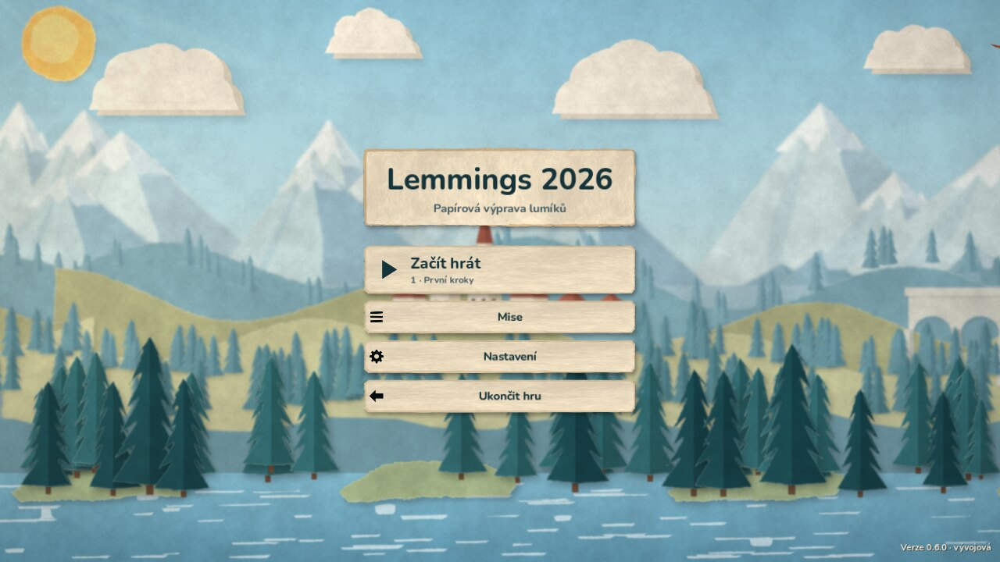
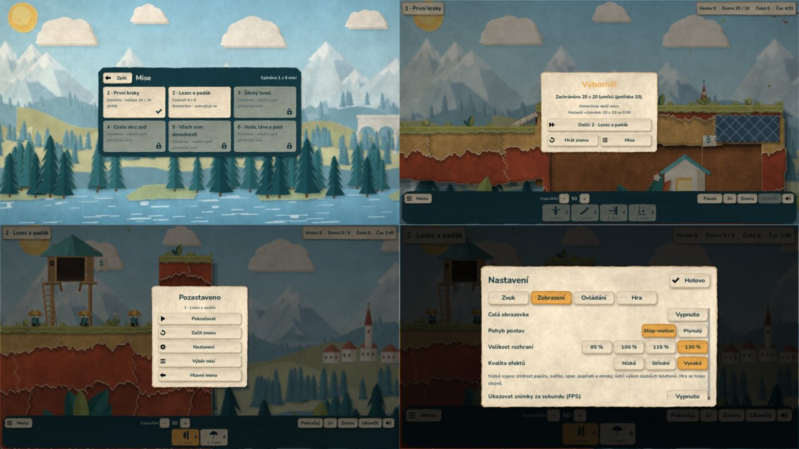
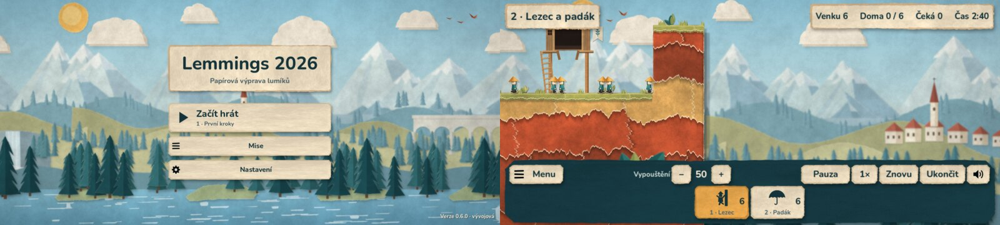

# Etapa 6 – menu, nastavení a ukládání

3. října 2026. Hra má hlavní menu, výběr misí s odemykáním, nastavení,
pauzovací menu, výsledek s přechodem na další misi a ukládá postup.





Telefon (20 : 9, dotykový profil) – menu bez tlačítka Ukončit hru
a hra s rozhraním zvětšeným na 130 %:



## Co hráč uvidí

- **Hlavní menu** nad pomalu proplouvající papírovou krajinou:
  - *Začít hrát* (první spuštění) / *Pokračovat* – rozehraná mise, jinak
    první nesplněná otevřená mise. Pod nápisem je vidět, kam vede.
  - *Mise* – šest karet. Splněná mise má fajfku a rekord (např.
    „nejlépe 20 z 20 (0:59)“), zamčená zámek. Další mise se otevře
    po splnění předchozí.
  - *Nastavení*, na počítači i *Ukončit hru*. Vpravo dole verze.
- **Ve hře** je vlevo dole tlačítko **Menu** (také **Esc** a na Androidu
  **Zpět**). Pauzovací menu: Pokračovat, Začít znovu, Nastavení, Výběr
  misí, Hlavní menu. Čas stojí, klávesy ani dotyky nepřidělují dovednosti.
  Původní tlačítko **Pauza** zůstává – v pauze jde dál přidělovat.
- **Výsledek** ukáže zachráněné, rekord, „Nový rekord!“ nebo „Odemčena
  další mise“ a tlačítka *Další: …*, *Hrát znovu* a *Mise*.
- **Nastavení** (z menu i z pauzy, změny platí hned):
  - *Zvuk*: celková hlasitost, efekty, rozhraní, okolí, hudba (připravená
    sběrnice), ztlumit vše.
  - *Zobrazení*: celá obrazovka (počítač), stop-motion / plynulý pohyb,
    velikost rozhraní 85–130 %, kvalita efektů nízká / střední / vysoká,
    počítadlo FPS.
  - *Ovládání*: posun myší u okraje (počítač), rychlost posunu kamery,
    dosah klepnutí na postavu, potvrzování „Ukončit“, přehled ovládání.
  - *Hra*: vývojové odemčení všech misí, Smazat postup (s potvrzením).
- **Kvalita efektů** mění jen ozdoby: nízká vypne zrnitost papíru, světlo
  a paprsky, opar, popředí, mraky a ptáky a sníží počet ústřižků; střední
  vypne paprsky a lístky. Telefon začíná na střední kvalitě a s větším
  dosahem klepnutí. Hra se hraje vždy stejně.

## Jak ukládání funguje

- Dva soubory v uživatelské složce: `settings.json` a `progress.json`.
  Ukládá se postup podle **stabilního identifikátoru mise** (např.
  `voda-lava-past`), ne podle pořadí, takže přidání nebo přeřazení misí
  výsledky nerozbije.
- **Přerušený zápis:** nová data jdou nejdřív do `.tmp`, ten se přečte
  a ověří, předchozí platná verze se zkopíruje do `.bak` a teprve potom
  se `.tmp` přejmenuje na hlavní soubor.
- **Poškozený soubor:** hlavička nese SHA-256 dat. Nesedí-li, soubor se
  odloží jako `.corrupt` a načte se záloha. Bez použitelné zálohy hra
  začne s výchozími hodnotami a nespadne.
- **Změna formátu:** každý soubor nese verzi. Neznámé a nesmyslné položky
  se nahradí výchozími; soubor z novější verze hry se před přepsáním odloží
  vedle. Dřívější `settings.cfg` (ztlumení zvuku) se převezme.
- **Rozehraná mise** se ukládá jako seznam příkazů a tik, ne jako stav
  světa. Simulace je deterministická, takže přehrání dá přesně stejný stav;
  otisk (počty, postavy, maska terénu) to ověří. Ukládá se při odchodu
  do menu, při přechodu aplikace na pozadí a při zavření okna. Obnovená
  mise začne v pauze. Když otisk nesedí (např. se mise mezitím změnila),
  pokus se zahodí a mise začne znovu.
- Hra spuštěná samostatně (editor F6, testy) nic nezapisuje.

## Ověření

- `python scripts/check.py`: **86 GDScriptů, 13 sad, 395 kontrol, vše
  v pořádku** (dříve 74 / 11 / 327). Stávající sady prošly beze změny
  výsledků simulace.
- Nová sada `tests/test_save.gd` (34 kontrol): zápis a čtení, záloha,
  useknutý `.tmp`, změněná číslice v datech (kontrolní součet), prázdný
  soubor, hlavička se špatnými typy, poškozený soubor i záloha, novější
  formát, převzetí `settings.cfg`, rozsahy a kroky nastavení, nesmyslné
  položky, pravidla odemykání a rekordů, identifikátory všech misí,
  rozehraná mise 4 s bombičem a změnou vypouštění: obnova dá **totožný
  stav** (postavy, terén, počty), pozměněný záznam se pozná a zahodí.
- Nová sada `tests/test_menu.gd` (32 kontrol) ve skutečné aplikaci:
  první spuštění → mise 1 vyhraná 20/20 → výhra hned na disku → *Další*
  → mise 2 → Esc / pauzovací menu blokuje čas a klávesy → *Hlavní menu*
  uloží rozehraný pokus → **nová instance aplikace („další den“)** načte
  splněnou misi, rekord na kartě a *Pokračovat* obnoví misi 2 na stejném
  tiku se stejným otiskem, v pauze, bez započtení nového pokusu.
  Dále velikost rozhraní 130 % (osm dovedností se vejde do 1280 × 720),
  kvalita efektů, FPS, posun kamery, hlasitost sběrnice, uložení
  nastavení z pauzy, Ukončit bez potvrzení, Zpět na Androidu, přechod
  na pozadí s okamžitým uložením a smazání postupu.
- **Uvolňování:** tři přechody menu → hra → menu, každý se dvěma
  restarty: počet uzlů po návratu vždy **150** (stejně jako před prvním
  spuštěním), **0** osiřelých uzlů; počet objektů po odchodu z mise
  **2059 → 2059**.
- **Grafický průchod** `scripts/qa_menu.gd` (Linux, software OpenGL,
  skutečná kliknutí myší přes vstup okna): menu, výběr misí, mise 1
  vyhraná 20/20 přes lištu a kliknutí na postavy, výsledek, *Další*,
  pauza, nastavení, přepnutí na 130 %, odchod s rozehraným pokusem,
  nová instance aplikace se zachovaným postupem i nastavením a obnova
  mise 2 na tiku 353. Stejný průchod prošel i v dotykovém profilu 20 : 9.

```bash
godot --path . --rendering-driver opengl3 --resolution 1280x720 --fixed-fps 20 \
  --script res://scripts/qa_menu.gd -- --capture-dir=build/menu [--mobile --mobile-preview]
```

Stejný průchod prošel i nad herními soubory vytaženými z APK 0.6.0
([Android demo](ANDROID_DEMO.md)).

## Meze

- Neověřeno na skutečném Macu ani telefonu: celá obrazovka na Macu,
  tlačítko Zpět a ukončení aplikace systémem Android (testy posílají
  stejné systémové zprávy, které Godot dostává).
- Hudba zatím není; posuvník Hudba ovládá připravenou sběrnici.
- Kvalita efektů je zvolená odhadem, výkon na telefonu změří až zařízení
  (počítadlo FPS je v nastavení).
- Technické testy nejsou posudkem vzhledu menu – ten musí posoudit autor.
