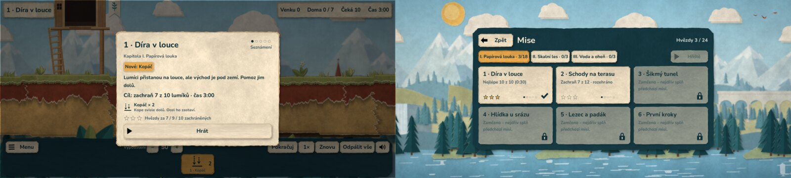
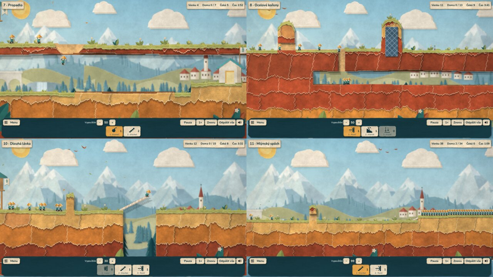
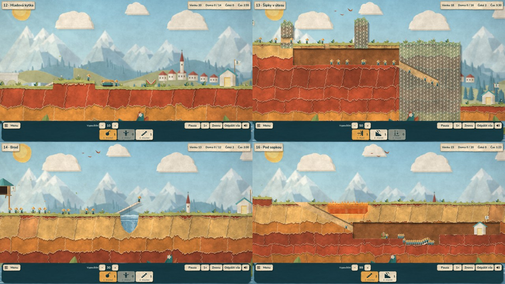
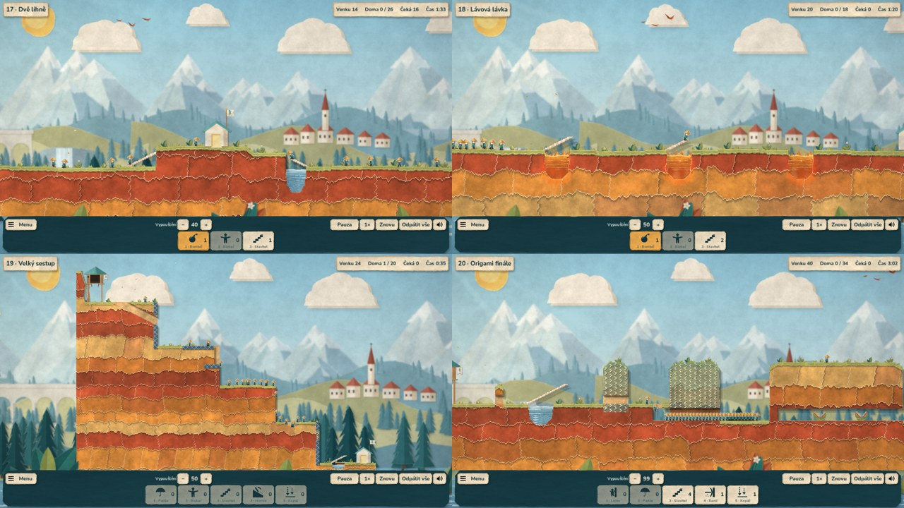

# Etapa 9 – kampaň: systémy a kapitoly I–IV

4. října 2026. Podle schváleného [herního designu](HERNI_DESIGN.md)
(autor odsouhlasil všech šest rozhodnutí) jsou hotové kroky 1, 2, 4, 5
a 6 plánu realizace: systémy kampaně a všechny čtyři kapitoly (20 misí).
Zároveň bylo vyřazeno 2.5D zobrazení a export Androidu hlídá stálý podpis.

Telefon (dotykový profil 20 : 9):

## Co je nového

- **Kapitoly.** Výběr misí má záložky I. Papírová louka (6 misí),
  II. Skalní les (5), III. Voda a oheň (5) a IV. Bouřková hora (4) se
  součtem hvězd; tlačítko **Hřiště** (otevře se po kapitole I) je
  v záhlaví.
- **Číslo mise** se dopočítá z pořadí („3 · Šikmý tunel“), názvy
  ve scénách jsou bez čísel.
- **Úvodní karta mise:** název, kapitola, tečky a název pásma obtížnosti,
  štítek „Nové: …“, krátký úvod, cíl a čas, dovednosti **s popisem**
  (čitelné i na telefonu) a prahy hvězd. Hra stojí, dokud hráč neklepne
  „Hrát“ (nebo Esc, Enter, mezerník, Zpět). Restart kartu neukazuje,
  obnovená rozehraná mise také ne.
- **Hvězdy:** ★ cíl, ★★ polovina cesty, ★★★ mistrovský výsledek = výsledek
  referenčního řešení (je tedy zaručeně dosažitelný). Ve výsledku:
  hvězdy, „Nová hvězda!“, „Další hvězda za N zachráněných“.
- **Nápověda:** v pauzovacím menu tlačítko „Nápověda“ (tipy od obecného
  po konkrétní); po dvou neúspěších ukáže výsledek první tip sám.
- **Odemykání** je vše do nejdál splněné mise + 1, takže nové mise
  vložené před již splněnou hráče nezamknou (postup je podle id).
- **„Odpálit vše“** místo „Ukončit“ v liště (nepleť si se zavřením hry).

## Kapitola I – změřená obtížnost

Výstup `scripts/difficulty_report.gd` (index 0–100, pásmo):

| # | Mise | Lumíci / cíl | Hvězdy | Index | Pásmo | Cíl z designu |
|---|---|---|---|---|---|---|
| 1 | Díra v louce (nová) | 10 / 7 | 7 / 9 / 10 | 15 | Seznámení | 5–15 |
| 2 | Schody na terasu (nová) | 12 / 7 | 7 / 10 / 12 | 14 | Seznámení | 12–19 |
| 3 | Šikmý tunel (upravená) | 8 / 6 | 6 / 7 / 8 | 18 | Seznámení | 15–24 |
| 4 | Hlídka u srázu (nová) | 15 / 11 | 11 / 13 / 14 | 23 | Lehká | 18–26 |
| 5 | Lezec a padák (upravená) | 8 / 6 | 6 / 7 / 8 | 32 | Lehká | 26–34 |
| 6 | První kroky (zkouška) | 20 / 13 | 13 / 17 / 20 | 38 | Lehká | 33–40 |
| 7 | Cesta skrz zeď (upravená) | 12 / 9 | 9 / 10 / 11 | 42 | Střední | 38–45 |
| 8 | Voda, láva a past | 10 / 6 | 6 / 7 / 8 | 61 | Těžká | 58–64 |

Dřívější křivka 30 → 44 → 30 → 54 → 27 → 61 je teď plynulá:
15 → 14 → 18 → 23 → 32 → 38 → 42 → 61. Žádná mise nejde vyhrát bez zásahu.

**Opravy návrhu při stavbě** (měření je odhalilo): v Díře v louce
a Hlídce u srázu by lumíci padali z povrchu až na dno jeskyně (80 px,
smrtelné) – jeskyně je proto mělčí (pád 55 a 52 px). Šikmý tunel měl
v prvním náčrtu sráz se schůdky, které šly sejít bez zásahu – sráz je
svislý. První kroky mají cíl 13 místo 14, aby zůstaly v pásmu Lehká.

## Kapitola II – Skalní les

Čtyři nové mise (N4–N7) a upravená Cesta skrz zeď. Snímky jsou ze
skutečné hry během referenčního řešení:

| # | Mise | Lumíci / cíl | Hvězdy | Učí | Index | Pásmo | Cíl z designu |
|---|---|---|---|---|---|---|---|
| 7 | Propadlo | 10 / 7 | 7 / 8 / 9 | bomba otevře podlahu | 33 | Lehká | 30–38 |
| 8 | Ocelové kořeny | 20 / 13 | 13 / 17 / 20 | razič, ocel ho zastaví | 36 | Lehká | 32–39 |
| 9 | Cesta skrz zeď | 12 / 9 | 9 / 10 / 11 | blokař + bomba | 42 | Střední | 38–45 |
| 10 | Dlouhá lávka | 20 / 15 | 15 / 18 / 20 | dva stavitelé v řadě | 51 | Střední | 45–52 |
| 11 | Mlýnský spěch | 40 / 34 | 34 / 37 / 40 | rychlost vypouštění, čas | 55 | Střední | 50–56 |

Celá křivka kampaně: 15 → 14 → 18 → 23 → 32 → 38 | 33 → 36 → 42 → 51 → 55
| 61. Začátek kapitoly II je záměrně o kousek lehčí než finále kapitoly I
(nová kapitola = nádech). Každá mise má úvod, štítek „Nové“ a dvě nápovědy.

**Co měření při stavbě odhalilo:**
- **Razič** musí začít do 8 px od zdi, takže okno pro jeho přidělení je
  vždy nejvýš 8 tiků. Pravidlo pásma Lehká je proto okno ≥ 8 tiků
  (v designu bylo 9) a Ocelové kořeny se prohodily s Propadlem.
- **Škvíra pod předměty:** zeď ohrádky v Dlouhé lávce končila 1 px nad
  zemí a lumíci pod ní prošli. Zdi, kmeny a hráze jsou teď zapuštěné
  do terénu (pravidlo v `CLAUDE.md`).
- **Mlýnský spěch** při limitu 2:00 šel splnit i bez zvýšení vypouštění –
  limit je 1:50. Bez zásahu nikdo nedojde.
- Ocelové kořeny mají cíl 13 (při 15 byl index mimo pásmo), Dlouhá lávka
  propast 40 px a cíl 15.

## Kapitola III – Voda a oheň

Čtyři nové mise (N8–N11) a stávající Voda, láva a past. Snímky ze
skutečné hry během referenčního řešení:

| # | Mise | Lumíci / cíl | Hvězdy | Učí | Index | Pásmo | Cíl z designu |
|---|---|---|---|---|---|---|---|
| 12 | Hladová kytka | 20 / 14 | 14 / 16 / 18 | past se dobíjí, hustý dav | 37 | Lehká | 30–38 |
| 13 | Šipky v útesu | 20 / 16 | 16 / 18 / 20 | jednosměrné zdi | 50 | Střední | 45–52 |
| 14 | Brod | 15 / 12 | 12 / 13 / 14 | voda, most, uvolnění blokaře | 56 | Střední | 52–58 |
| 15 | Voda, láva a past | 10 / 6 | 6 / 7 / 8 | kombinace nebezpečí | 61 | Těžká | 58–64 |
| 16 | Pod sopkou | 25 / 20 | 20 / 21 / 22 | horník pod lávou, past, čas | 63 | Těžká | 62–68 |

Kapitola začíná oddechem (37) po zkoušce kapitoly II (55) a končí
zkouškou v pásmu Těžká. Bez zásahu nejde vyhrát žádná mise.

**Co měření při stavbě odhalilo:**
- **Hladová kytka** má dvě řešení: zrychlené vypouštění dá 16 (★★),
  blokař s bombou 18 (★★★, referenční). Bez obojího kytka sní polovinu
  (10 z 20) a cíl 14 nevyjde.
- **Pod sopkou:** kytka s dobíjením 50 by snědla 5–6 lumíků a mistrovský
  výsledek by splynul s cílem – dobíjení je 120. Dav drží pohromadě stupeň
  na louce (zpátky se nevyleze) a zrychlené vypouštění. Horník funguje,
  když začne 46–90 px před jezerem (změřeno po 4 px); později vede tunel
  lávou, dřív mine jeskyni.
- **Brod** byl s původními čísly lehčí (48) – má cíl 12, čas 2:30
  a 3 stavitele. Blokař musí stát dál než 16 px od mostu, jinak výbuch
  rozbije jeho začátek.

## Kapitola IV – Bouřková hora

Čtyři nové mise (N12–N15), kampaň má všech 20 misí. Snímky ze skutečné
hry během referenčního řešení:

| # | Mise | Lumíci / cíl | Hvězdy | Učí | Index | Pásmo | Cíl z designu |
|---|---|---|---|---|---|---|---|
| 17 | Dvě líhně | 30 / 26 | 26 / 28 / 29 | dvě skupiny najednou | 66 | Těžká | 63–70 |
| 18 | Lávová lávka | 20 / 18 | 18 / 19 / 19 | přesnost na doraz | 73 | Těžká | 72–78 |
| 19 | Velký sestup | 25 / 20 | 20 / 21 / 22 | sestup bez padáků | 84 | Mistrovská | 80–86 |
| 20 | Origami finále | 40 / 34 | 34 / 35 / 36 | všechno dohromady | 91 | Mistrovská | 85–92 |

Celá křivka: 15 → 14 → 18 → 23 → 32 → 38 | 33 → 36 → 42 → 51 → 55 |
37 → 50 → 56 → 61 → 63 | 66 → 73 → 84 → 91. Žádná mise nejde vyhrát
bez zásahu.

**Co měření při stavbě odhalilo:**
- **Dvě líhně:** pravý stupeň kopce měl 10 px a lumíci na něj nevylezli
  (zvládnou 6) – je nižší. S původním cílem 22 a časem 4:00 vyšel index
  52; mise má cíl 26 a čas 2:00.
- **Lávová lávka:** se dvěma jámami po 21 px index 60 a okno 7 tiků;
  teď tři jámy po 22 px (okno 6 tiků) a čas 1:55.
- **Velký sestup:** dav po tunelech předběhne průzkumníka s padákem
  (padák je pomalý) a utopil by se v jezírku dřív, než je lávka. Blokař
  proto nahoře drží dav, dokud průzkumník nepřipraví cestu. Lumíci těsně
  za horníkem ho na čtvrté terase předběhnou dřív, než vznikne tunel –
  referenční řešení zachrání 22 z 25, cíl je 20.
- **Origami finále:** průzkumník (lezec s padákem) připraví celou cestu,
  dav čeká v ohradě. Schody na útes musí začít 50–52 px před ním; když
  stavitel narazí do stěny, otočí se a spadne pod lávkou do lávy. Útes
  je o 2 px nižší, jinak by šly schody postavit jen z jediného místa.
  Mise má jednu líheň místo dvou (čitelnost).
- **Menu:** tlačítko Hřiště je v záhlaví vedle hvězd, aby se do řádku
  vešly čtyři záložky kapitol (ověřeno i v dotykovém profilu).

## Vyřazení 2.5D

Smazána scéna `main/game_3d.tscn`, `view/clay_*`, podklady
`assets/clay/` a model z `assets/art_v2/`, 3D testy a QA skripty
(−4 900 řádků). Písmo Nunito je nově v `assets/fonts/` s licencí OFL
a vlastním manifestem (soubor beze změny). Testy dotyku a etapy 4 běží
nad origami scénou. APK je o 5 MB menší.

## Podpis Androidu

`scripts/export_android.sh` ověří otisk podpisového klíče proti
`scripts/android_signing.txt` a hotové APK zkontroluje apksignerem;
s jiným klíčem export skončí chybou (záměrná výměna jen
s `LEMMINGS_ALLOW_NEW_KEY=1`). Samotný klíč zatím zůstává jen v tomto
cloudovém prostředí – trvalé uložení mimo něj čeká na rozhodnutí autora.

## Ověření

- `python scripts/check.py`: **76 GDScriptů, 13 sad, 380 kontrol, vše
  v pořádku** (bez 3D sad; nové kontroly kampaně, hvězd, odemykání,
  úvodní karty a Hřiště). Po kapitolách II a III znovu 380 kontrol,
  po kapitole IV 381 (kontrola navazování přibyla za novou kapitolu);
  testy procházejí všechny mise kampaně, takže pokryjí i nové.
- `tests/test_save.gd` (44): kapitoly navazují, číslování, Hřiště mimo
  kampaň, prahy hvězd, odemykání po vložení misí, Hřiště po kapitole I,
  každá mise má úvod, nápovědu a mistrovský výsledek nad cílem.
- `tests/test_menu.gd` (37): úvodní karta zastaví čas a blokuje klepnutí,
  výhra mise 1 (10/10) dá 3 hvězdy, Další otevře misi 2 s kartou, pauza,
  odchod s rozehraným pokusem, „další den“, Hřiště, Zpět.
- `tests/test_difficulty.gd`: každá mise kampaně má referenční řešení,
  vyhraje a zachrání přesně mistrovský výsledek.
- `scripts/difficulty_report.gd`: všech 20 misí v cílovém pásmu, index
  zapsaný v misi odpovídá měření, žádná nejde vyhrát bez zásahu.
- Grafický průchod `scripts/qa_menu.gd` na počítači i v dotykovém profilu
  a znovu **nad herními soubory vytaženými z APK 0.7.0**.

## Meze

- Na telefonu a Macu neověřeno (výkon, čitelnost karty na malém displeji).
- Pomocníci (krok o tik, zpomalení, ukázka řešení) a ladění křivky podle
  hraní jsou další kroky plánu. Kapitola IV má okna 2–8 tiků – bez kroku
  o tik a zpomalení bude na telefonu hodně náročná.
- Nové mise kapitol II–IV zatím nikdo nehrál – měření říká jen, že jsou
  řešitelné a jak těsná jsou okna; zábavnost ověří až tvoje hraní.
- Okno zásahu se měří posunem jednoho příkazu při pevných ostatních.
  U řetězu zásahů (Pod sopkou: horník → stavitelé) vyjde proto užší než
  skutečná volnost hráče (horník 5 tiků v měření, 44 px při hraní).
