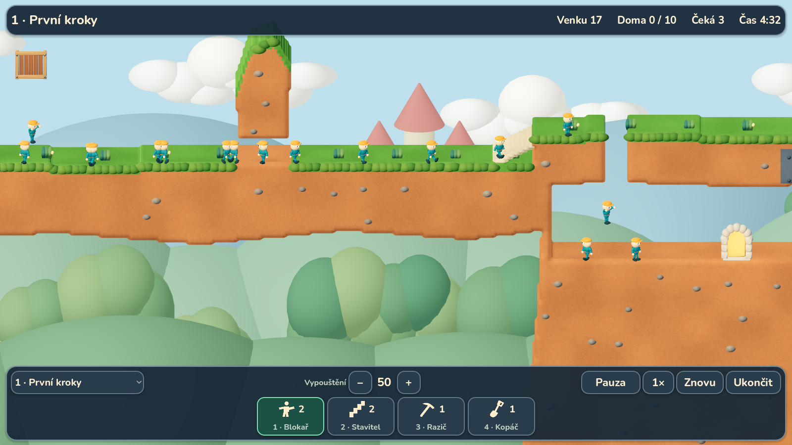
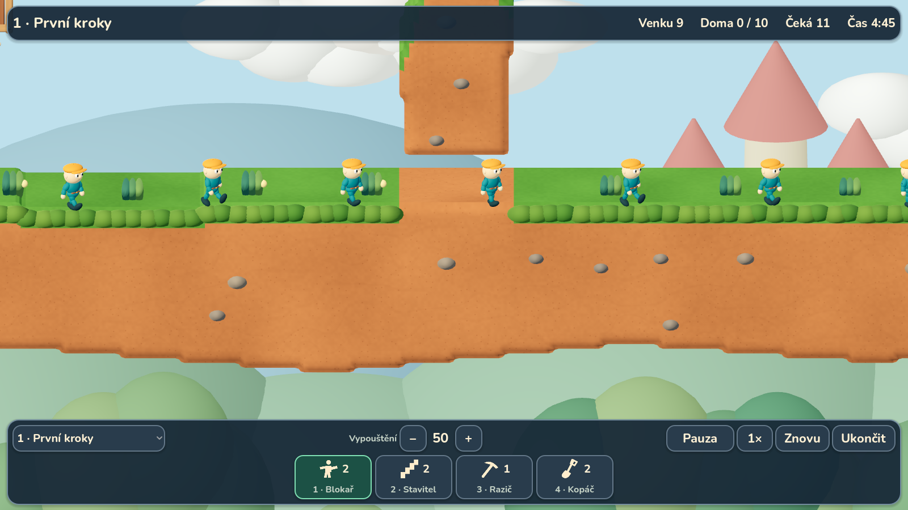
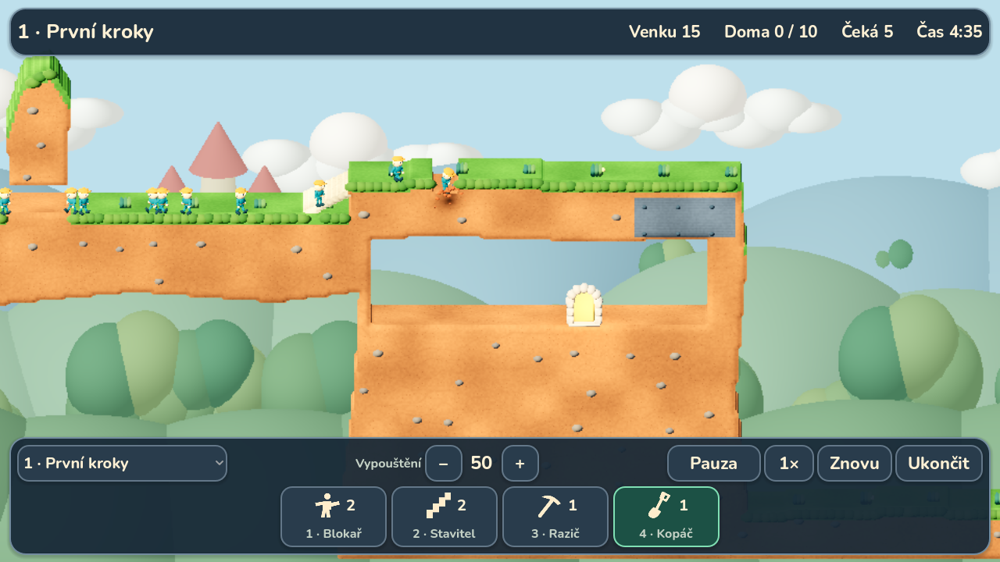

# Grafika 0.4.0 — první výtvarná úprava hratelné scény

3. října 2026. Autor schválil přesun grafické práce před další mechaniky.
Cílem této verze je přiblížit skutečnou hru vybranému modelínovému mockupu.
Jde o první provedení scény, nikoli o dokončení finální grafiky celé kampaně.



## Co je ve hře

- Terén má zaoblený přední okraj, matný teplý materiál, jemné póry,
  modelovaný zelený lem, rostliny a zapuštěné kamínky. Čerstvý tunel i šachta
  dostávají stejný oblý profil; původní tráva uvnitř nového tunelu neroste.
- Postavička má větší hlavu, výraznější obličej, širší tělo, boty a ruce.
  Natáčí se částečně k hráči. Zachovává 16 kostí, 11 klipů a pracovní rytmus
  řízený simulací. Herní velikost a pravidla výběru se nezvětšují s hlavou.
- Za herní plochou jsou prostorové vrstvy krajiny, stromy, oblé mraky,
  hrad a voda. Dekorace nezasahují do kolizí ani do výběru postavy.
- Kamera má sklon 18° a bližší výchozí záběr. Světlo je zvlášť vyvážené
  pro desktopový Forward+ a mobilní Compatibility. Východ má jemné světlo.
- Rozhraní používá oblé tmavé panely, Nunito, větší ikony a zelené označení
  vybrané dovednosti. Doplněné jsou vlastní ikony lezce, padáku a bombiče.
  Osm tlačítek se vejde do společné lišty na návrhovém rozlišení telefonu.



## Terén, opora dekorací a kolize

Simulace a definice misí se nemění. Obsazení středů buněk vykreslené přední
plochy se kontroluje proti logické masce včetně oceli, cihel a prázdných
otvorů. Zaoblení smí posunout roh siluety o nejvýše 0,22 buňky v každé ose;
nepředstírá přesný pravoúhlý obrys původního technického meshe.

Přední profil má hloubku 0,16 m a šířku tří buněk. Plochý vnitřek zůstává
sloučený do větších ploch, detail vzniká pouze u obvodu. Oblasti 32 × 32
čtou stejné okolí masky, včetně normál, aby na švu nevznikalo jiné zaoblení.
Renderer sleduje změny s okolím osmi buněk: to pokrývá i rozptyl kamínků
a jejich oporu. Každý čtenář nadále sleduje revize samostatně.

Rostliny a kamínky mají oporu ověřenou v živé masce; po odstranění podkladu
se jejich MultiMesh přestaví. Nezůstávají nad vyhloubeným otvorem. Zeleň,
kamínky a pozadí používají sdílené meshe. Lokální promáčknutí a odlétající
hrudky zůstávají vizuálním efektem; nejde o simulaci měkké fyziky.

## Podklady a reprodukce

Původní sada `assets/clay/` zůstává beze změny (50 souborů podle manifestu).
Nová sada `assets/art_v2/` obsahuje 13 ověřovaných souborů: odvozený GLB,
editovatelný Blender, jeho generátor, tři SVG ikony, písmo, licence a metadata.
`assets/art_v2.lock.json` eviduje SHA-256. `scripts/check_assets.py` ověřuje
oba balíčky. Verze nové sady je 0.2.0, verze hry 0.4.0.

Postava má 10 272 trojúhelníků, rozpočet 15 000; model neodkazuje na externí
soubory. Původ původního modelu a generátoru je zaznamenaný v `provenance.json`.
Nunito pochází z oficiálního repozitáře Google Fonts a používá SIL OFL 1.1.
Licence je v repozitáři i v exportovaném APK.

Model lze znovu vytvořit Blenderem 4.3.2:

```bash
blender --background --python assets/art_v2/source/build_models.py
```

Nástroj `game-dev` v tomto prostředí nebyl dostupný. Použité byly místní
Blender, kontroly struktury GLB, manifesty a vlastní grafické průchody
Godotu. Nejde o zapečetěný běh nástroje Game Development Studio.

## Co prošlo

- `python scripts/check.py`: 56 GDScriptů, osm sad, **186 kontrol**,
  čistý import a výchozí spuštění. Simulace, replay, dotyk a osm dovedností
  mají stejné výsledky jako před výtvarnou změnou.
- Geometrie: shoda obsazení buněk a materiálů, orientace trojúhelníků,
  uzavřené boky, řezy na švech, kruhový výbuch, oddělené cihly, samostatní
  čtenáři masky a shoda postupných oprav s úplným přestavěním.
- První mise: **20 zachráněných, 0 ztracených, 1014 tiků** ve Forward+
  i Compatibility; druhý průchod přiděluje dovednosti přes dotyk a HUD.
- Další mise v Compatibility: **6/6, 6/6 a 3/4**, včetně lezení, padáku,
  šikmého kopání, odpočtu a výbuchu. Ověřená lišta osmi dovedností a dialog.
- Stejný průchod dalších misí je provedený i s herními soubory vytaženými
  přímo z APK 0.4.0. Podpis APK, obě ARM architektury, CRC, manifest,
  16KiB zarovnání a přiložené licence mají samostatnou kontrolu.



Snímky v tomto dokumentu jsou přímé záběry Godotu bez dodatečného retušování.
Desktopový průchod používá 1600 × 900, mobilní 1280 × 720 s 75% rozlišením
3D. Schválený generovaný mockup zůstává oddělenou výtvarnou referencí.

Opakování vizuálních kontrol s dostupným grafickým displejem:

```bash
godot --path . --rendering-method forward_plus --audio-driver Dummy \
  --script res://scripts/qa_art.gd -- --capture-dir=/tmp/lemmings-art
godot --path . --rendering-method gl_compatibility --audio-driver Dummy \
  --script res://scripts/qa_3d.gd -- --touch --mobile-preview \
  --capture-dir=/tmp/lemmings-touch
godot --path . --rendering-method gl_compatibility --audio-driver Dummy \
  --script res://scripts/qa_stage4.gd -- --mobile-preview \
  --capture-dir=/tmp/lemmings-skills
```

## Výkon a zbývající práce

Grafické průchody běžely na Linuxu s llvmpipe. Dotykový průchod zaznamenal
CPU čas aktualizace snímku p95 13,5 ms, maximum 29,4 ms; samotná obnova
terénu p95 27,3 ms, maximum 28,7 ms. Jde o různě vzorkované části běhu,
bez doby kreslení GPU. Tyto hodnoty nejsou FPS telefonu ani důkaz 60 FPS.
Některé přestavby přesahují rozpočet 16,7 ms; další optimalizaci je potřeba
řídit měřením na cílovém zařízení.

Instalace a výkon na skutečném Androidu ani macOS v tomto běhu ověřené
nejsou. APK je testovací, se stejným podpisem jako 0.3.0, takže může být
aktualizací předchozí instalace. [Stažení a podrobnosti](ANDROID_DEMO.md).

Další výtvarné ladění zahrnuje detail animací a efektů, variace dekorací,
čitelnost na konkrétním telefonu a následně další prostředí kampaně.
Zvuk, celá kampaň a úplná etapa 7/8 nejsou součástí tohoto dokončeného úkolu.
