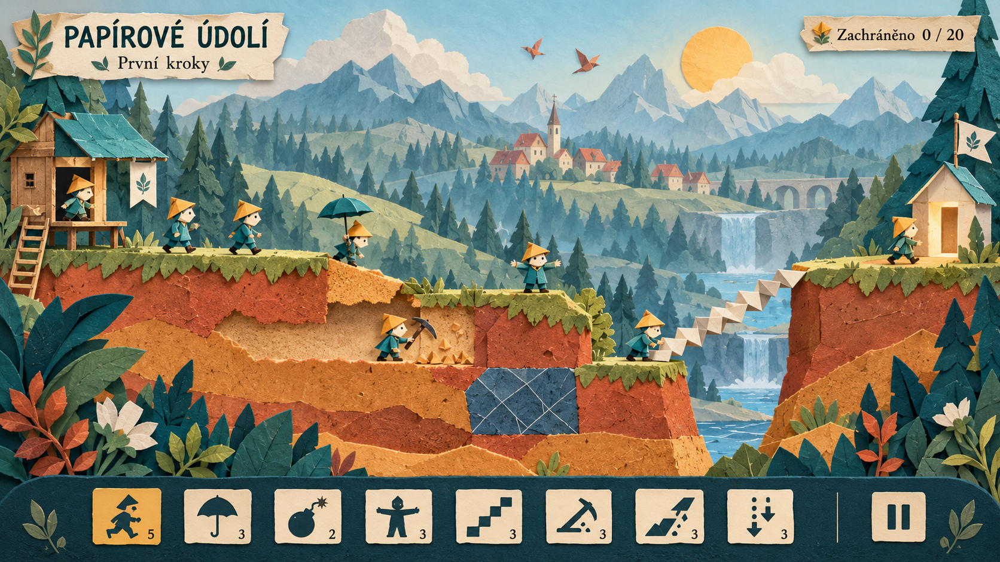

# Origami — první mockup

3. října 2026. Autor odmítl také modelínový výřez v3 a navrhl **čistě 2D
papírový/origami styl s paralaxním posunem i zoomováním**. Pořadí práce je
výslovně **mockup → posouzení vzhledu → scéna Godotu**.

**Stav: autor návrh přijal jako jediný další výtvarný podklad.** Označil jej
za pěkný a požádal o nahrání na GitHub a odstranění předchozích návrhů.
Jde o jeden
generovaný obrázek, nikoli snímek hry, animaci nebo sadu oddělených vrstev.
„Papírové údolí“ je pouze pracovní nápis v návrhu, nikoli schválené přejmenování hry.

## Co návrh ukazuje

- Skládané tyrkysové postavičky s okrovou papírovou čepicí a výrazným přehybem.
- Terén z trhaných barevných vrstev, vodorovný výkop s ústřižky,
  odlišenou nerozbitnou plochu a rozkládané harmonikové schody.
- Papírovou líheň a východ, čitelnou spodní lištu osmi dovedností.
- Vzdálené hory a oblohu, les a vesnici ve střední vzdálenosti,
  ostrou herní vrstvu a rostliny v popředí. Tyto pásy určují zamýšlenou
  hloubku budoucí paralaxy; nejsou ještě exportované zvlášť.

## Až po posouzení vzhledu

Připravit samostatné obrazy vrstev včetně částí nyní zakrytých terénem,
postavičku s animacemi a materiály řezu. V Godotu zachovat postavy,
schůdný terén a stavební schody v jedné 2D soustavě. Dekorativní vrstvy
reagují rozdílně na posun a řízeně také na zoom; jejich transformace
nesmějí ovlivnit kolize ani převod kliknutí. HUD zůstává na obrazovce.

Kopání nadále pouze vodorovně, šikmo dolů a svisle dolů. Nahoru vedou
stavitelovy schody. Simulace a dosavadní mechaniky se zachovají; zobrazení
bude nově 2D. Kompozice obrázku není ověřenou řešitelnou mapou levelu.
Před použitím se doladí čitelnost ikon, velikosti postav a okrajů cest.

## Původ a ověření

Vytvořeno hostitelským nástrojem `image_gen.imagegen`, bez referenčních
souborů. [Přesný prompt](concepts/origami-v1/prompt.txt) a
[původ, rozměry a SHA-256](concepts/origami-v1/provenance.json) jsou uložené.
PNG byl otevřen, vizuálně prohlédnut a beze změn zkopírován; shoda kopií
byla ověřena. Obrázek nebyl retušován. Neproběhla implementace ani měření
paralaxy a nevzniklo nové APK. Předchozí návrhy byly z aktuální větve
odstraněny; běžná historie Git zůstává zachovaná.

## Kontrola po úklidu

`python scripts/check.py`: 56 GDScriptů, osm sad a 186 ověření; prošel
parser, lint, import v čisté kopii i spuštění hlavní scény. Obě používané
herní sady (50 + 13 souborů) odpovídají původním manifestům. Ověřeny byly
lokální odkazy dokumentace a SHA-256 nového PNG i promptu. Tyto kontroly
ověřují zachování funkčního základu po odstranění studie, nikoli nový
origami renderer nebo nativní běh na Androidu či Macu.
