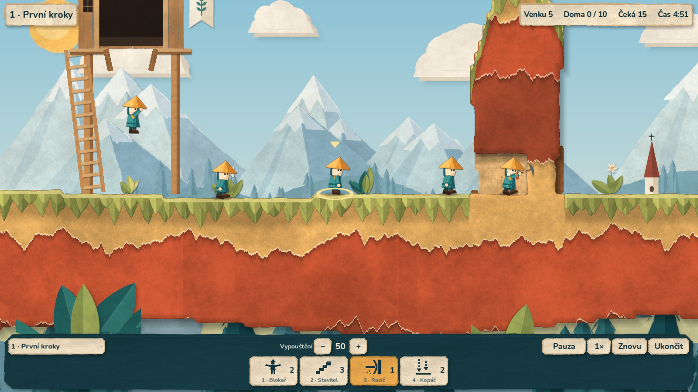
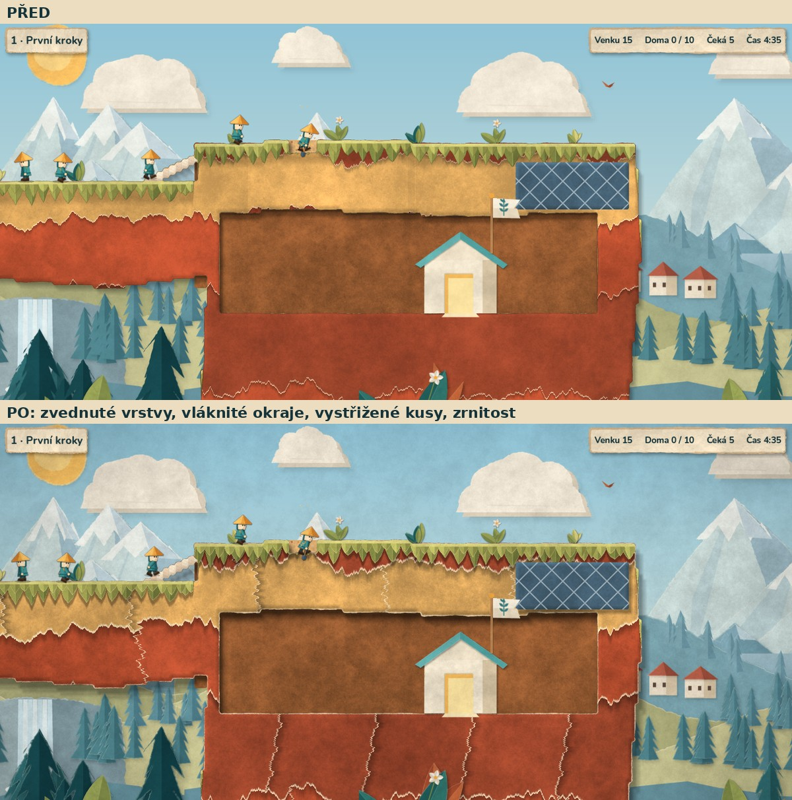
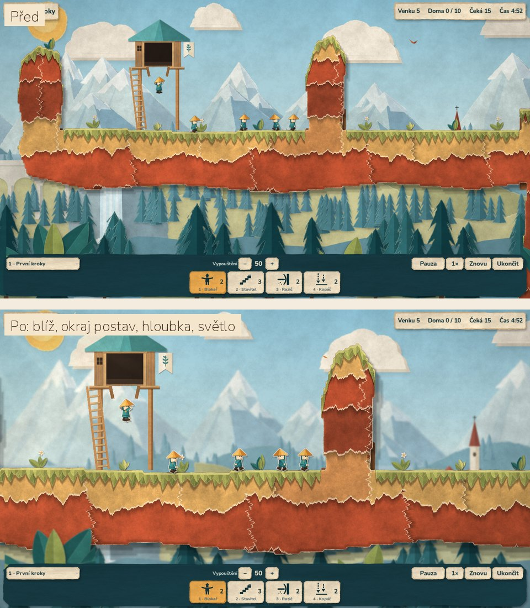
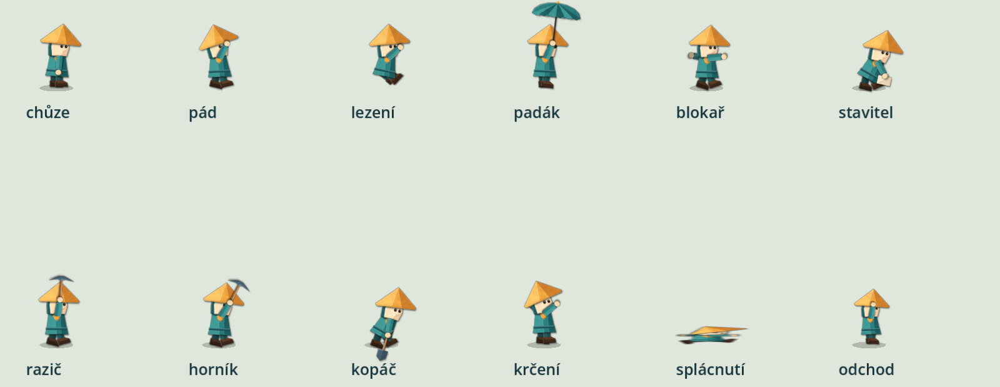
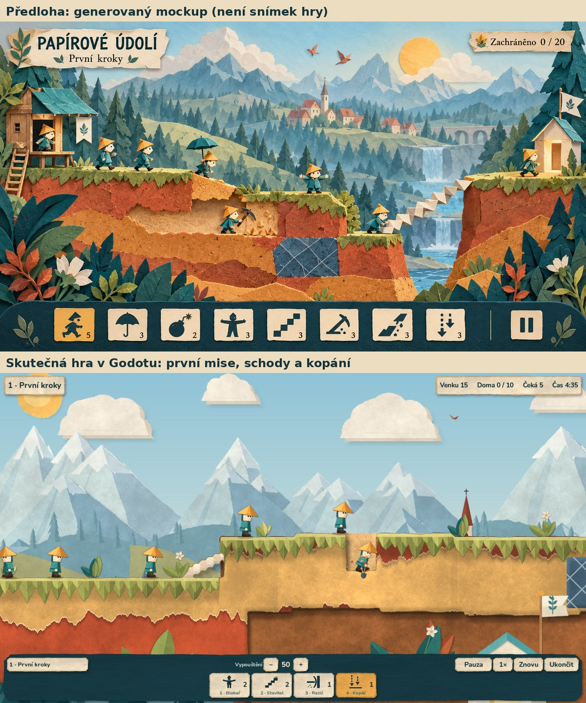

# 2D origami — implementace a ověření

3. října 2026. Výchozí scéna hry je nově `main/game_origami.tscn`:
čistě 2D papírové zobrazení podle přijatého [mockupu](MOCKUP_ORIGAMI.md).
Simulace, mise a pravidla se nezměnily; vyměnila se prezentace a její
napojení (kamera, převody souřadnic, dotyky, HUD).



Etapa 5 doplnila vodu, lávu, pasti a jednosměrné zdi:
[ověření etapy 5](ETAPA_5_OVERENI.md).

Záznam (17 s, 1280 × 720): [`images/origami-zaznam.mp4`](images/origami-zaznam.mp4)
— chůze, přiblížení kolečkem, ražení, posun tažením, rozkládání schodů,
kopání, oddálení, přiblížení dvěma prsty a vstup do východu.

## Papírovější vzhled (2. kolo, 3. října 2026)

Na přání autora (body 1–4 a pokus se stop-motion):

1. **Zvednuté vrstvy:** terén vrhá měkký stín na krajinu i zadní stěny;
   listy terénu stíní listy pod sebou. Rozmazání dávají mipmapy masky.
2. **Bílé vláknité okraje:** natržené hrany listů, obrys terénu i stěny
   výkopů mají světlé jádro papíru proměnné šířky; v generátoru dostaly
   jádro hory, kopce, stromy, mraky, slunce, střechy a lístky, díly postav
   a domky „tloušťku“ papíru (světlá hrana vlevo nahoře, tmavší vpravo dole).
3. **Terén z vystřižených kusů:** každá vrstva se dělí na kusy různé šířky
   s natrženými šikmými švy, překryvem, stínem, odstínem a mírným náklonem.
   Ocel je nalepený díl se stínem, lístky mechu mají vlastní stíny.
4. **Zrnitost a vinětace:** jemné papírové žíhání a ztmavení rohů přes
   celou herní scénu (HUD zůstává čistý).
5. **Stop-motion (výchozí, klávesa M přepíná):** póza postav se mění po
   2 ticích (od etapy 5 každý tik, chvění dál po 2 ticích), poloha po celých ticích, díly se při každém kroku nepatrně
   chvějí; dvířka a vlajka se hýbou po ticích. Kontakt nástroje zůstává na
   tiku změny masky. Je to jen vzhled, simulace se nemění.



## Čitelnost, hloubka a živá krajina (3. kolo, 3. října 2026)

Na přání autora (body: čitelnější postavičky, hloubka a světlo, živá krajina):

1. **Čitelnější postavičky:** výchozí pohled je blíž (počítač 2×, telefon
   2,6×), postavy mají světlý papírový okraj jako nálepka a vržený stín na
   pozadí. Okraj sousedních postav splývá (jedna vrstva pod všemi).
2. **Hloubka a světlo:** vzdálenější vrstvy krajiny i popředí jsou
   rozostřené jako na fotce papírového dioramatu (předem v generátoru, ve hře
   to nic nestojí), vzdálené vrstvy mají opar, teplé světlo slunce zleva
   s jemnými paprsky, chladnější strana vpravo dole, delší stín terénu,
   tmavší úzké tunely a středy jeskyní.
3. **Živá krajina:** mraky pomalu plují (každý jinou rychlostí), hejnko tří
   ptáčků mává křídly a přelétá oblohu, rostlinky, mech na hranách terénu
   i trsy v popředí se kývají ve větru, občas se snese lístek nebo okvětní
   plátek a chvíli poleží na zemi, plameny nad lávou jsou nepravidelné.
   Vše běží podle herního času: pauza to zastaví, stop-motion to posouvá
   po krocích.



Záznam (13 s): [`images/origami-ziva-krajina.mp4`](images/origami-ziva-krajina.mp4).

Ověření 3. kola: `check.py` 71 GDScriptů, 10 sad, 297 kontrol (nové kontroly
výchozího pohledu, okraje postav, mraků, mávání ptáků, oparu a zastavení
dekorací pauzou). Grafický průchod mise 1 znovu: počítač 1920 × 1080
klávesnicí a myší 20/20, terén 34 720 buněk bez neshody; telefon 20:9
klepnutím 20/20, terén 50 592 buněk bez neshody; dva prsty bez herního
příkazu. Generátor dál dává bit po bitu stejné soubory. Rozostření je
předpočítané v podkladech, ve hře nepřidává výpočet; nové jsou jen průchod
světla přes obrazovku a obrys postav (8 kopií dílů pod každou postavou).
Výkon na skutečném Macu a telefonu zbývá změřit.

Porovnání pohybu (vlevo stop-motion, vpravo plynule):
[`images/origami-stopmotion.mp4`](images/origami-stopmotion.mp4).

## Co je hotové

| Oblast | Stav |
|---|---|
| Vrstvy krajiny | nebe (přechod), slunce a mraky, hory s přehyby a sněhem, střední pás (kopce, vesnice s kostelem, viadukt, vodopád, les), blízký les s řekou; každá vrstva je vodorovně navazující a obsahuje i místa zakrytá terénem |
| Popředí | tři trsy papírových listů a květ; nízký rám u spodní lišty, zprůhlední nad postavou, líhní a východem |
| Terén | shader z masky: listy trhaného papíru (terakota, okr, písek) se světlým vláknitým okrajem a stínem, mech z lístků na původním povrchu, ocel s mřížkou, harmonikové schody z cihel, světlá zadní stěna výkopu, tmavší jeskyně, vržený stín |
| Objekty | papírová chatka na kůlech s žebříkem, praporkem a padacími dvířky (otevřou se před prvním vypuštěním), domek východu se zlatými dveřmi a vlající vlajkou, drobné rostlinky na povrchu (mizí s vykopanou zemí) |
| Postavička | 9 dílů (čepice, hlava s kapucí, kabátek, 2 paže, 2 nohy, nářadí) s plochami přehybů, vláknem a vlastním stínem; nářadí: krumpáč, lopata, deštník rozevřený i složený, papírová cihla |
| Animace | chůze, pád, pád se složeným deštníkem, lezení, plachtění (deštník se rozevře za 5 tiků), blokování, stavění, vodorovné ražení, šikmé a svislé kopání, krčení ramen, splácnutí, vstup do východu; přechody 3 tiky; otočka jako otočení papírku; odpočet bomby na papírovém štítku |
| Efekty | papírové ústřižky z kopání, ražení, výbuchu, oceli, splácnutí a východu; rozkládání harmonikové cihly |
| Kamera | jediná herní transformace, zoom 1×–3,2× kolem kurzoru nebo středu prstů, hranice mapy, klávesy, okraj obrazovky, kolečko, gesto touchpadu, tažení |
| Paralaxa | posun i zoom vrstev odvozené z kamery; vzdálené vrstvy reagují méně (exponenty zoomu 0,04 / 0,12 / 0,3 / 0,5, herní rovina 1) |
| HUD | papírový: krémový štítek s názvem, proužek se stavem, petrolejová lišta, slonovinové dlaždice s novými ikonami, okrová vybraná dlaždice, papírové dialogy |

Podklady: `assets/origami/` (vrstvy, papír, objekty, atlas a kostra
postavy, HUD, ikony SVG), původ `provenance.json`, licence `LICENSE.txt`,
kontrolní součty `assets/origami.lock.json`. Vše generují vlastní skripty
`assets/origami/source/*.py` s pevnými seedy (`build_all.py`). Z mockupu
nebyly kopírovány pixely; převzaty jsou změřené barvy a výtvarné principy.

## A. Automatické testy (headless, Linux)

`python scripts/check.py` s Godotem 4.7 stable: **66 GDScriptů, 9 sad,
232 kontrol, vše v pořádku** (před origami 56 / 8 / 186). Integrita
podkladů: 50 + 13 + 48 souborů souhlasí s manifesty; `build_all.py --check`
potvrdil, že generátor dává bit po bitu stejné soubory. Nová sada
`tests/test_origami.gd` (46 kontrol) ověřuje:

- přesnou vratnost převodu logika ↔ obrazovka a shodu s herní transformací
  pro poměry 16:9, 20:9, 4:3, 1:1 a tři velikosti levelu,
- že kamera při žádném zoomu ani poměru stran neukáže prostor mimo level,
- zoom kolem kurzoru (bod pod kurzorem zůstane), meze zoomu, posun prstem,
- pokrytí obrazovky vrstvami bez mezer, pořadí paralaxy pro posun i zoom
  a plynulost (žádný skok vrstvy při postupném zoomu),
- statickou texturu terénu (mech jen na původním povrchu, ne v jeskyni),
  obnovu textury jen při změně masky a pouze čtení revizí,
- úplnost animací pro všechny stavy a kontakt nástroje v tiku změny masky,
- dotyky ve 2D: klepnutí po uvolnění, posun ani dva prsty nepřidělí
  dovednost, dotyk začatý v HUDu nepatří hře, emulovaná myš nezdvojí příkaz,
  skutečný dotyk a klik myší ve scéně, kolečko a tažení pravým tlačítkem,
- pauzu animace i simulace, animaci podle tiků, otočku postavy,
- stop-motion: mezi tiky se póza ani poloha nehýbou, klávesa M přepne
  na plynulý pohyb (a zpět) bez herního příkazu,
- zprůhlednění popředí nad postavou,
- **celou první misi přes origami scénu a dotykové přidělení: 20/20**
  a totožný stav (snímek celé simulace včetně masky) s replayem čisté simulace,
- další zkušební mise v origami scéně přes dotyk: lezec a padák 6/6,
  šikmý tunel 6/6, cesta skrz zeď 3/4 (požadavek splněn), vždy shodné
  s replayem čisté simulace.

## B. Grafický průchod v cloudu (Linux, Xvfb, software OpenGL llvmpipe)

`scripts/qa_origami.gd` posílá skutečné vstupní události do okna hry.

| Průchod | Výsledek |
|---|---|
| Desktop 1600 × 900 okno (viewport 1920 × 1080), klávesy 1–4, klik myší, kolečko, tažení pravým tlačítkem, gesto dvěma prsty | 20/20 zachráněno, 3 ze 3 přidělení napoprvé, dva prsty přiblížily bez herního příkazu |
| Telefon 20:9 (1600 × 720), klepnutí na dlaždice a postavy, posun jedním prstem, přiblížení dvěma prsty | 20/20 zachráněno, 3 ze 3 přidělení klepnutím napoprvé, dva prsty přiblížily bez herního příkazu; terén 50 592 buněk, 0 neshod |
| Přesnost terénu: kontrolní režim shaderu kreslí jen pevný terén; střed každé viditelné buňky porovnán s maskou po ražení, schodech, kopání, výbuchovém kruhu a přidaných cihlách při zoomu 3,2× | 34 720 buněk, 0 neshod |
| Všech 12 stavů postavy vykreslených skutečným `PaperActors` a galerie dovedností na hřišti | pózy odpovídají náhledu generátoru (stejný výpočet kloubů), nářadí, deštník i odpočet bomby se zobrazují |

Snímky: [start](images/origami-hra-start.jpg) ·
[ražení zblízka](images/origami-hra-1.png) ·
[přehled po kopání](images/origami-hra-prehled.jpg) ·
[telefon 20:9](images/origami-hra-mobil.jpg) ·
[všech 12 póz z enginu](images/origami-postavy.jpg) ·
[porovnání s mockupem](images/origami-porovnani.jpg).



Software renderer v cloudu kreslí jeden snímek přibližně za 0,2 s
(1920 × 1080, CPU). To není měření výkonu na skutečné grafické kartě.
Druhé kolo přidalo do shaderu terénu další vzorky textur (měkké stíny,
kusy, okraje) a jeden celoobrazovkový průchod se zrnitostí; výkon na
telefonu je potřeba změřit na zařízení.

## C. Vizuální posouzení proti mockupu (subjektivní)



Shoduje se: paleta a materiály (tyrkys/okr/krém postav, terakotové a okrové
vrstvy, šalvějový mech, břidlicová ocel s mřížkou, krémové harmonikové
schody), papírová chatka s tyrkysovou střechou a praporkem, domek východu se
zlatými dveřmi a vlajkou, krajina se sluncem, mraky, horami, vesnicí,
viaduktem, vodopádem a lesem, rostliny v popředí, petrolejová lišta se
slonovinovými dlaždicemi a okrovým výběrem, štítek s názvem a stavem.

Rozdíly, které zůstávají:

- Mockup je bohatší ručně malovaná ilustrace. Generované vrstvy jsou
  jednodušší: stromy a hory mají méně variací, mraky jsou kupovité tvary
  s rovným spodkem, chatka i domek mají méně detailů.
- Terén v mockupu tvoří velké bloky s přední plochou; hra kreslí čistě
  boční pohled se širokými trhanými vrstvami a mechem z lístků.
- Postavy jsou při výchozím zoomu menší než v mockupu (asi 4–5 % výšky
  obrazovky); čitelné detaily obličeje vyniknou až při přiblížení.
- Úlomky z kopání odlétají a mizí; mockup ukazuje trvalé hromádky.
- Kompozice: hra používá původní mise, v první je východ v jeskyni.
- Písmo HUDu je Nunito (bezpatkové), mockup má patkové.

## D. Běh na konkrétním zařízení

Neověřeno. Nové zobrazení nebylo spuštěno na Macu ani na Androidu a nevzniklo
nové APK ani Mac balíček; APK 0.4.0 obsahuje starou 2.5D grafiku. Výkon na
skutečné GPU (zejména mobilní) zbývá změřit. Shader terénu používá jen
funkce dostupné v rendereru Compatibility (OpenGL ES 3).

## Jak průchod zopakovat

```bash
python scripts/check.py
xvfb-run -a -s "-screen 0 1600x900x24" godot --path . --rendering-driver opengl3 \
  --script res://scripts/qa_origami.gd -- --capture-dir=build/origami/desktop \
  --record=build/origami/frames
xvfb-run -a -s "-screen 0 1600x900x24" godot --path . --rendering-driver opengl3 \
  --script res://scripts/qa_origami.gd -- --capture-dir=build/origami/mobile --mobile
ffmpeg -framerate 30 -i build/origami/frames/frame_%05d.jpg -vf scale=1280:-2 \
  -c:v libx264 -crf 27 -pix_fmt yuv420p docs/images/origami-zaznam.mp4
```
