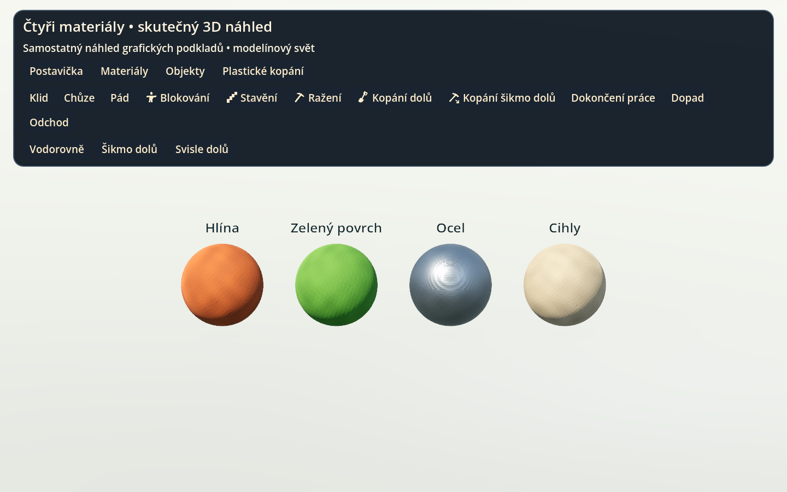
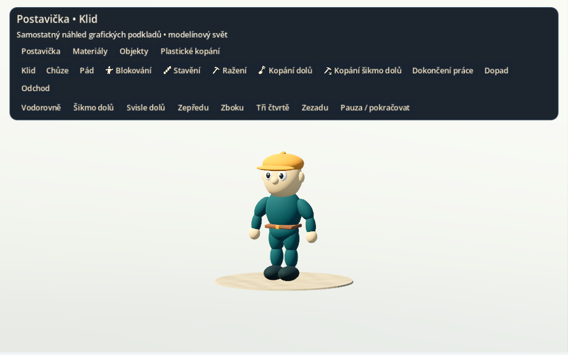

# Modelínové podklady a animace — sada 0.1.0

Dokončeno 2. října 2026. První sada pro technický 2.5D prototyp je připravená
jako samostatný projekt Godotu. Dodržuje schválené pořadí: grafické podklady,
potom postavička s animacemi, následně zapojení do hry.

Navazující stav: podklady již byly zapojené do hratelného prototypu;
viz [ověření etapy 3](ETAPA_3_OVERENI.md). Text níže popisuje samostatný
archiv grafické sady před tímto zapojením.

## Balíček a otevření

Archiv: `Lemmings-2026-modelinove-podklady-0.1.0.zip` (19 044 786 bajtů).
V tomto cloudovém pracovním prostoru je uložen v
`/workspace/artifacts/lemmings-art-kit/`, odděleně od herního projektu.
ZIP obsahuje 85 souborů včetně zdrojů, protokolů a manifestu.

SHA-256 archivu:
`9e61643c3591bdd9703e8fb4cf4b31b6961a8cddd70699f8d6bcca1a32b74bba`

1. Rozbal celý ZIP.
2. Pro rychlou prohlídku otevři `index.html`; náhledy a videa fungují lokálně.
3. Pro interaktivní prohlídku importuj přiložený `project.godot` do Godotu
   a spusť F5. Blender pro běžné spuštění není potřeba.

Galerie přepíná postavičku, materiály, objekty a deformaci hlíny. Nabízí
všechny animace, pauzu, čtyři pohledy a tři směry kopání. Podrobný návod
je uvnitř archivu v `CTI_ME.md`.

## Co je hotové

| Část | Obsah |
|---|---|
| Materiály | Hlína, zelený povrch, ocel, stavební hmota; čtyři Godot materiály |
| Mapy | 24 PNG, 1024 × 1024 px: barva, normála, drsnost, kovovost, ORM, výška |
| Postavička | Původní GLB, 10 272 trojúhelníků, 16 kostí, zdrojový Blender soubor |
| Animace | Klid, chůze, pád, blokování, stavění, ražení, kopání dolů, šikmé kopání dolů, dokončení práce, dopad, odchod |
| Objekty | Líheň, východ, ocelová deska, cihla, krumpáč, lopata — šest GLB |
| Rozhraní | Deset SVG ikon, barevný motiv Godotu |
| Scéna náhledu | Ortografická kamera, měkké hlavní světlo, výplň, dynamické stíny, odrazy, SSAO |
| Deformace | Pohybová studie promáčknutí, protažení a odtržení hrudky ve třech směrech |
| Předání | Offline galerie, dvě videa, náhledy, generátory, testy, původ a licence, SHA-256 manifest |

Animace jsou na místě, posun postavičky bude řídit simulace. Šikmé kopání
má připravený klip, samotná dovednost horníka patří do etapy 4. Lezec,
padák a bombič budou potřebovat další animační klipy při jejich implementaci.
Kopání vzhůru se podle rozhodnutí autora nepřipravuje.

## Skutečné náhledy

Následující obrázky pocházejí z vykreslování galerie v Godotu,
nikoli z generovaného mockupu:

Záznam `previews/animace-postavicky.mp4` obsahuje všech jedenáct klipů
(12,54 s). Záznam `previews/plasticke-kopani.mp4` ukazuje jeden cyklus
deformace (3,25 s). Další směry lze přepnout přímo v galerii.

## Provedené ověření

- **2 696 statických kontrol** skutečných PNG a GLB: rozměry, návaznost
  textur, normály a kanály ORM, geometrie, váhy kostry, časování a smyčky.
- **Čistý import v Godotu 4.7** bez předchozí cache a bez chyb či varování.
- **257 kontrol v Godotu:** materiály, 16 kostí, 11 klipů, změny skutečných
  póz, objekty, ikony, režimy galerie, deformace a připojení lopaty.
- **Skutečné vykreslování Forward+ přes Vulkan** v Linuxovém cloudu
  (softwarový ovladač llvmpipe); kontrola výsledných snímků.
- Ověřené místní odkazy HTML, čitelnost videí H.264, CRC archivu a SHA-256
  každého souboru podle přiloženého manifestu.

Protokoly jsou v `evidence/`, výsledky statické kontroly v `validation.json`.
Godot: `4.7.stable.official.5b4e0cb0f`; autorský Blender: 4.3.2.
Balíček používá vlastní validaci. Lokální CLI game-dev nebylo k dispozici,
proto nejde o kanonický balíček ověřený tímto CLI.

## Rozsah a navazující práce

Jde o první úplnou sadu pro technický prototyp, nikoli o finální grafiku
celé kampaně. Schválený mockup zůstává cílovou výtvarnou předlohou;
detaily a vzhled celku se doladí při sestavení scény.

Studie hlíny není hotové kopání v levelu ani fyzikální simulace plastelíny.
Není propojená s maskou, lumíky nebo kolizemi. Další krok musí vytvořit
geometrii podle logické masky a sladit trvalé otvory, údery nástrojů,
animace a úlomky se simulačními tiky. Pouze vizuální deformace může zůstat
nezávislá na pravidlech. Měkké stíny se ověří i v tunelech a při změnách terénu.

Nativní spuštění ani výkon na MacBooku s Godotem 4.7.1 nebyly v cloudu
ověřeny. Windows testy zůstávají odložené a Android později dostane
vlastní grafický profil. Nynější herní kód ani 2D renderer tato sada nemění.

Původní modely, textury a ikony jsou vytvořené pro tento projekt, bez
převzatých assetů originální hry. Podrobnosti jsou v `LICENSE.txt`
a `provenance.json`; generované reference jsou přiložené s původem.
