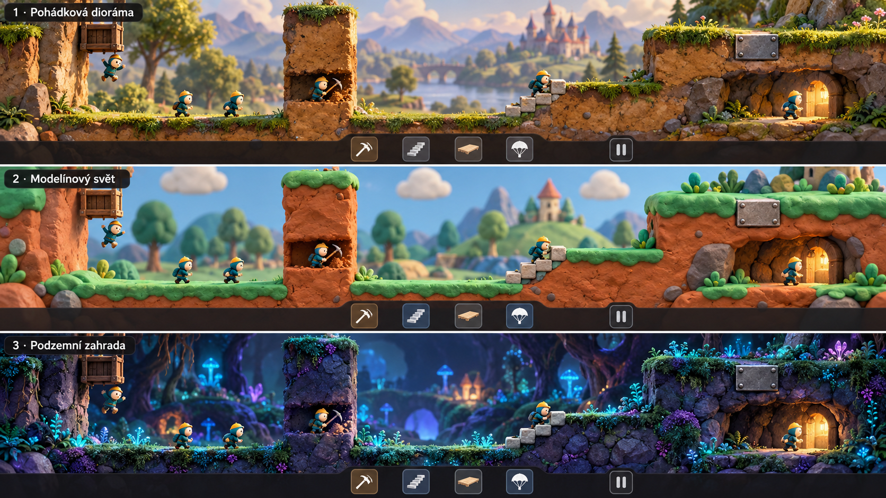
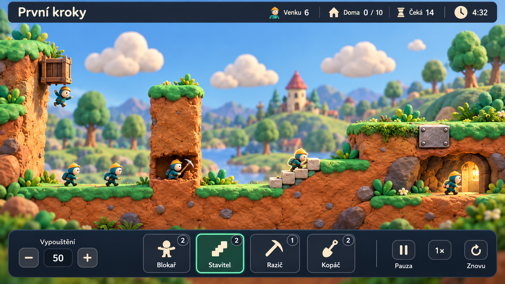

# Výtvarný směr — Modelínový svět

Vybráno autorem 2. října 2026: **varianta 2 — Modelínový svět** ze tří
konceptů stejné herní scény. Tento směr je základem dalších grafických
podkladů a 2.5D prototypu.

## Referenční koncept

Vybraná varianta je **prostřední panel** srovnání:

Obrázek vznikl generováním konceptu v této konverzaci. Slouží jako výtvarná
reference; první samostatná sada modelů, animací a materiálů je již připravená.
Volba stylu neurčuje definitivní podobu postavičky, ikon ani geometrii levelu.

## První mockup herní obrazovky

Na žádost autora vznikl celkový mockup levelu „První kroky“ ve vybraném
modelínovém stylu: šest postaviček, líheň, kopání, stavěné schody, ocel,
východ a český HUD se čtyřmi současnými dovednostmi.

Stav: **autorem schválená výtvarná předloha** (2. října 2026), vytvořená
generováním obrazu. Nejde o snímek
implementovaného rendereru ani o ověřenou geometrii hratelného levelu.
Pozice objektů a dekorací se při implementaci přizpůsobí logické masce.

## Pracovní zásady podle vybrané varianty

- Ručně modelovaný vzhled: oblé tvary, matné povrchy a jemné nepravidelnosti.
- Teplá oranžová až terakotová hlína, svěží zelený povrch a světle modré pozadí.
- Malé výrazné postavičky s dobře čitelnou siluetou a odlišeným oblečením.
- Měkké světlo, přehledné stíny a klidnější pozadí než aktivní herní plocha.
- Hlína, nerozbitná ocel a postavené schody se rozlišují barvou i tvarem.
- Zaoblení a dekorace zachovávají čitelnost hran odpovídajících logické masce.
- Prostor vytváří hloubka diorámy a pevná ortografická kamera; pohyb zůstává
  v jedné herní rovině.
- Modelínový vzhled sám o sobě nepředepisuje trhanou stop-motion animaci.
  Pohyb může dál používat plynulou interpolaci současné simulace.

Konkrétní odstíny, proporce a úroveň detailu se zpřesní na dalších podkladech.

## Grafická příprava na začátku etapy 3

Schválené pořadí: **podklady → postavička s animacemi → zapojení do hry**.
Všechny tři části jsou pro technický prototyp hotové; skutečná hratelná
scéna a kontroly jsou v [ověření etapy 3](ETAPA_3_OVERENI.md).
Samostatná sada 0.1.0 obsahuje:

1. Čtyři materiály: hlínu, zelený povrch, ocel a stavební hmotu,
   každý se šesti mapami 1024 × 1024 px a hotovým materiálem pro Godot.
2. Původní prostorovou postavičku v tyrkysovém oblečení se žlutou čepicí,
   kostru se 16 kostmi a 11 animačních klipů včetně tří způsobů kopání.
3. Líheň, východ, ocelovou desku, cihlu, lopatu a krumpáč; deset SVG ikon.
4. Samostatnou galerii s ortografickou kamerou, měkkým světlem, stíny,
   odrazy, SSAO a pohybovou studií deformace hlíny.

Skutečné snímky a popis ověření jsou v [podkladech prototypu](PODKLADY_PROTOTYPU.md).
Modely jsou zapojené do prvního prototypu; finální detail a sladění celé
scény s mockupem naváže při tvorbě reprezentativního dema.

## Plastelína při kopání

Hmota drží tvar. Nástroj ji místně promáčkne a protáhne, oddělí měkkou
hrudku a zanechá zaoblenou stopu. Ocel se takto deformovat nebude.
Samostatná galerie zůstává pohybovou studií. Ve hře už trvalý otvor řídí
společná 2D simulace a promítá se do prostorové geometrie. Shader doplňuje
promáčknutí normál/stínování a úlomky se protahují; nejde o fyzikální simulaci
měkké hmoty. Změna cesty lumíků nesmí vzniknout pouze v rendereru.

Kopání pouze **vodorovně, šikmo dolů a svisle dolů**, jako v původní hře.
Kopání vzhůru autor výslovně vyřadil; nahoru vedou stavitelovy schody.

Detailní výroba grafiky celé kampaně naváže na ověřené kopání, stavění,
kameru a výkon. Hlavní plán nadále obsahuje dvanáct etap.
