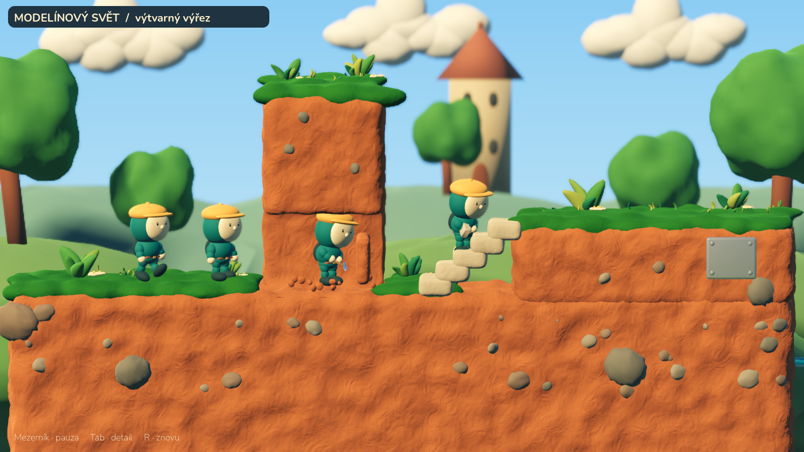
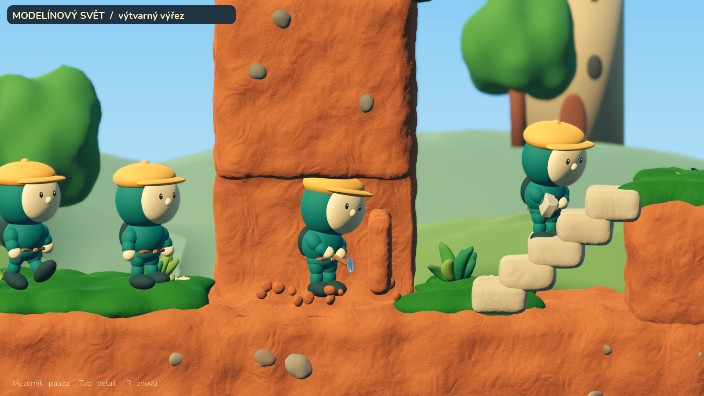

# Modelínový svět — výtvarný výřez v3

3. října 2026. Samostatná skutečná scéna Godotu vznikla jako reakce na
nevyhovující grafiku 0.4.0. Původní schválený mockup zůstává referencí.
Tento výřez dosud nemá autorovo vizuální schválení.



## Otevření na Macu

[Stáhnout samostatný projekt Godotu](https://github.com/JendaNDT/Lemmings-2026/raw/refs/heads/downloads/clay-reference-v3/Lemmings-Modelinovy-vyrez-v3.zip).
Rozbal celý ZIP, v Godotu 4.7 / 4.7.1 zvol **Import**, vyber jeho
`project.godot`, počkej na načtení modelů a stiskni **F5**. Blender ke
spuštění nepotřebuješ; editovatelné zdroje jsou přiložené pro další výrobu.

Mezerník přepíná pauzu, **Tab** přepíná celkový pohled/detail a **R** opakuje
animace od začátku. [Krátký přímý záznam Godotu](videos/reference-v3.mp4).

V hlavním repozitáři otevři `studies/clay_reference.tscn` a spusť aktuální
scénu přes **F6**. Výchozí F5 tam stále spouští hru. Samostatný ZIP má jako
hlavní scénu přímo tento výřez, takže v něm funguje F5 bez nastavování.

## Co se změnilo proti 0.4.0

| Oblast | Nové provedení |
|---|---|
| Hlína | Modelované uzavřené objemy, široké nepravidelnosti a menší stopy po práci; jemný shader doplňuje geometrii. |
| Zelený lem | Spojená organická hmota s převisy; prostorové listy mají různé velikosti, směry a tloušťku. |
| Postava | Kratší končetiny, větší hlava s kapucí, jednoduchý kulatý obličej, čepice a čitelnější silueta. |
| Tunel a kontakt | Zaoblený autorský otvor; okolní zastínění se vypočítává paprsky podle skutečné geometrie a ukládá do barev vrcholů. |
| Světlo | Teplé hlavní světlo, chladnější doplnění, fyzické stíny a v desktopovém profilu SSAO a hloubka ostrosti. |
| Pohyb hmoty | Krátká řízená deformace oddělovaného kusu, následné zmenšení a hrudky; pracovní klipy a nástroje na kostře postavy. |



Krajina a detaily animací jsou stále jednodušší než v původním mockupu.
Výřez ověřuje konkrétní provedení postavy, hlíny, zeleně a světla;
neprokazuje věrnou reprodukci celé referenční obrazovky.

## Přesný rozsah

Terén je **autorská statická geometrie** vytvořená v Blenderu. Není to nová
implementace `ClayMesher` a neřídí ji `TerrainMask`. Ukázka odtržení kusu
hlíny je řízená animace ve výtvarné scéně, nikoli fyzika plastelíny nebo
herní příkaz kopání. Schody jsou pět hotových modelovaných bloků.

Nový model zachovává 16 kostí a 11 klipů; čas ve studii řídí její vlastní
ukázková smyčka. Při zapojení do hry ho musí opět určovat simulační tiky.
Přenos vzhledu do dynamického terénu musí zachovat kolize, otvor po kopání,
sousední oblasti a výkon. Tato integrace v tomto úkolu provedena nebyla.

Podklady a scéna jsou oddělené v `assets/reference_v3/` a `studies/`.
Produkční exportní profily je zatím vylučují. Stávající hra, její levely
a vydané APK 0.4.0 se tím nemění.

## Původ, reprodukce a ověření

Všechny nové modely jsou autorská tvorba pro projekt. Postava odvozuje
kostru a klipy od původní sady a `art_v2`; přesný původ a hashe jsou
v `provenance.json` a `assets/reference_v3.lock.json`. Nebyl použit placený
generátor ani cizí model. Nástroj `game-dev` v cloudu není dostupný;
použité byly Blender 4.3.2, přímé kontroly GLB a skutečné běhy Godotu.

- Dvanáct souborů sady má SHA-256; původní sady 50 + 13 souborů zůstávají
  beze změny. Všechny tři sady ověřuje `scripts/check_assets.py`.
- Scéna má 290 328 trojúhelníků při rozpočtu 350 000; jedna postava 14 920
  při rozpočtu 20 000. Jde o rozpočet samostatné studie, nikoli o potvrzení
  rozpočtu celé mobilní hry s davem postav.
- GLB mají pouze vložené zdroje, konečné pozice vrcholů a ověřené struktury.
  Postava obsahuje všech 16 kostí a 11 animací.
- Herní kontrola prošla: 58 GDScriptů, osm sad, 186 ověření, čistý import
  a spuštění. Výchozí herní simulace zůstává beze změny.
- Samostatný ZIP má ověřené CRC a shodu souborů s manifestem. Ověřuje se
  jeho skutečně rozbalená kopie, nikoli pouze pracovní projekt.
- Rozbalený projekt prošel grafickým během ve Forward+ i Compatibility;
  pauza, návrat do pohybu, přepnutí detailu a restart prošly přes vstupní
  události klávesnice. [Strojový záznam](reference-v3-verification.json).
- Grafické záběry i video pocházejí přímo z Godotu; nejsou generovaným
  konceptem ani dodatečně retušovaným obrázkem. Video skládá 48 přímých
  vykreslených snímků při 24 snímcích/s.

Grafické ověření probíhá na Linuxu s llvmpipe. Nejde o nativní test macOS
nebo Androidu ani měření FPS cílového zařízení. Compatibility neposkytuje
stejné SSAO a rozostření jako Forward+; neslibovat identický mobilní obraz.

```bash
blender --background --python assets/reference_v3/source/build_worker.py
blender --background --python assets/reference_v3/source/build_stage.py
python scripts/check_assets.py
python scripts/package_reference.py
godot --path . --rendering-method forward_plus --audio-driver Dummy \
  --script res://scripts/qa_reference.gd -- --check-controls --record \
  --capture-dir=/tmp/clay-reference
```

Po záměrné výrobní změně znovu zkontrolovat GLB a aktualizovat jejich
validaci, původ a manifest. Binární soubory Blenderu nemusejí být při
opakovaném uložení bitově totožné; neočekávanou změnu hashe nepřekrývat.
